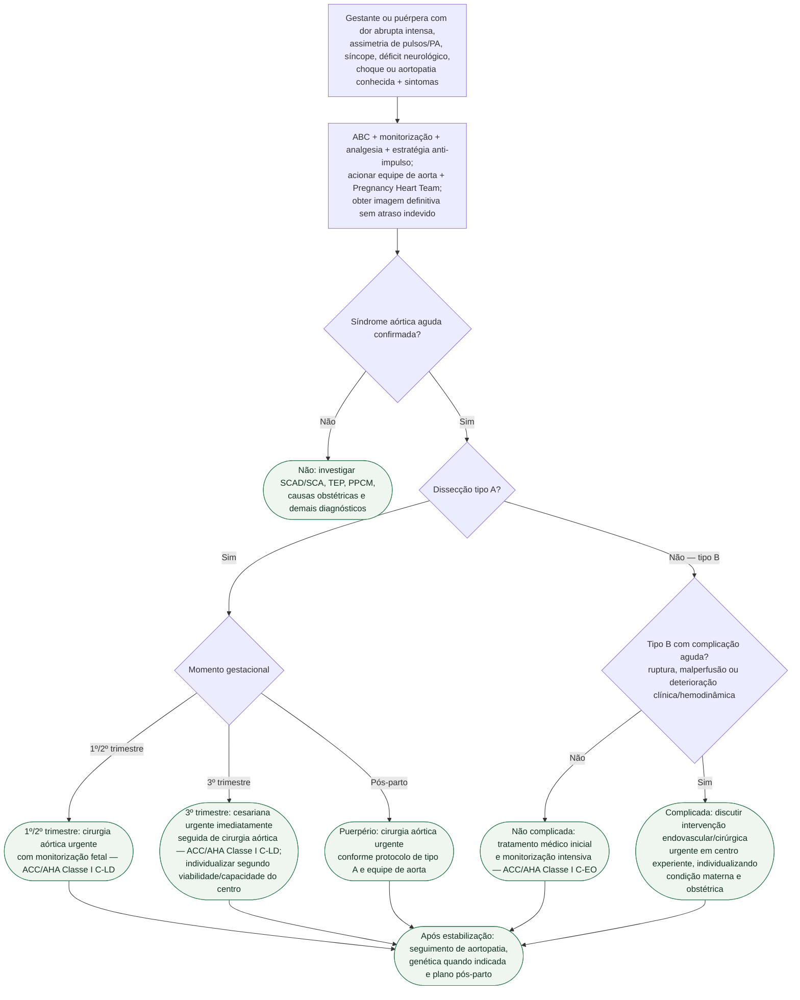

# Síndrome aórtica aguda na gestação/puerpério

## Regra prática

**Tipo A na gestação é emergência cirúrgica. Tipo B é inicialmente médico se não complicada.** A gestação modifica a coordenação materno-fetal, não elimina a urgência da doença aórtica.
