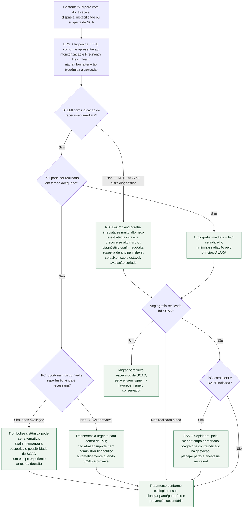

# SCA na gestação ou puerpério

Gestação não reduz a indicação de reperfusão. ECG, troponina e ecocardiograma
seguem a lógica habitual; elevação de troponina representa lesão miocárdica e
supradesnivelamento de ST não é alteração fisiológica da gravidez. Em paralelo,
considerar TEP, síndrome aórtica, cardiomiopatia periparto e pré-eclâmpsia.

## Árvore de decisão

## Reperfusão e SCAD

Indicações de angiografia e PCI são comparáveis às da paciente não gestante.
Em SCA de alto ou muito alto risco, a ESC recomenda angiografia imediata e PCI
quando indicada; a exposição deve ser reduzida pelo princípio ALARA, sem reter
um procedimento necessário.

No **STEMI que exige reperfusão**, fibrinólise sistêmica pode ser alternativa
quando PCI oportuna não está disponível. Esse raciocínio não se estende ao
NSTE-ACS: instabilidade ou alto risco nesse fenótipo indicam estratégia
invasiva imediata/precoce, não lise sistêmica. O fibrinolítico não atravessa a
placenta em quantidade relevante, mas pode
causar sangramento, inclusive subplacentário. Como SCAD é a causa mais frequente
de SCA associada à gestação/puerpério e trombólise pode agravar dissecção ou
hematoma, essa alternativa exige avaliação do mecanismo e risco hemorrágico —
não um reflexo após “falha” de uma angiografia que já ocorreu.

## Antiagregação, parto e anestesia

Aspirina e clopidogrel são as bases quando DAPT é necessária; a ESC considera
clopidogrel seguro pelo menor tempo possível e contraindica ticagrelor na
gestação por embriotoxicidade. Prasugrel fica reservado a situações especiais,
como metabolização deficiente de clopidogrel, após decisão especializada.

O parto é planejado conforme condição materna e obstétrica. **Clopidogrel deve
ser suspenso por pelo menos 5 dias antes de anestesia neuraxial** para reduzir
risco de hematoma epidural. Isso não autoriza interromper precocemente DAPT após
stent sem comparar risco de trombose; cardiologia, obstetrícia e anestesia devem
definir o calendário em conjunto.

## Tudo com Tudo

- [SCA por SCAD na gestação e puerpério](fluxograma-sindrome-coronariana-aguda-por-scad-na-gestacao-e-puerperio-esc-2025.md)
- [Síndrome coronariana aguda — ESC 2023](../Doença_coronariana/fluxograma-sindrome-coronariana-aguda-esc-2023.md)
- [TEP agudo na gestação e puerpério](fluxograma-tromboembolismo-pulmonar-agudo-na-gestacao-e-puerperio-esc-2025.md)
- [Síndrome aórtica aguda na gestação e puerpério](fluxograma-sindrome-aortica-aguda-na-gestacao-e-puerperio.md)
- [Cardiomiopatia periparto descompensada](fluxograma-cardiomiopatia-periparto-descompensada-e-choque-no-puerperio-esc-2025.md)
- [Eclâmpsia e hipertensão grave](fluxograma-eclampsia-e-hipertensao-grave-na-gestacao.md)
