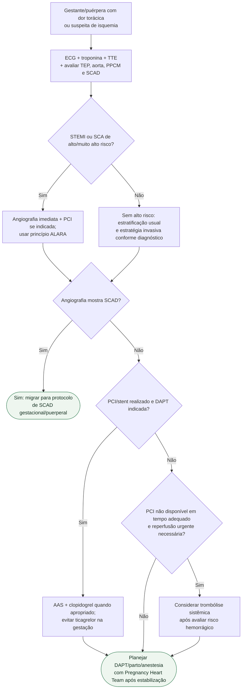

# SCA na gestação/puerpério

## Regra prática

Gestação **não reduz indicação de reperfusão**. A adaptação está em radiação, antiagregantes e planejamento do parto — não em aceitar isquemia persistente.