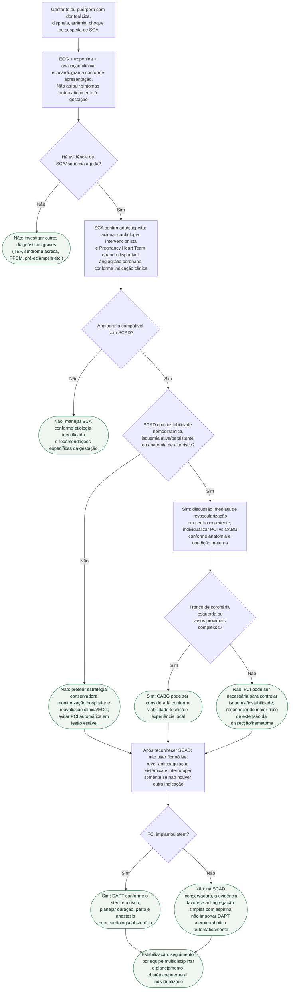

# SCA por SCAD na gestação e no puerpério

## Regra prática

A diferença essencial é: **SCAD estável sem isquemia persistente favorece tratamento conservador**. Instabilidade, isquemia contínua ou anatomia de alto risco mudam o balanço para revascularização urgente individualizada.

Anticoagulação pode ampliar hematoma intramural e deve ser revista após o
diagnóstico, mas não é suspensa se houver outra indicação independente. Na SCAD
sem stent tratada conservadoramente, a ESC 2025 registra evidência favorável a
aspirina isolada; após stent, a DAPT decorre do dispositivo e exige planejamento
do parto. A decisão deve considerar sangramento e fase gestacional.

## Tudo com Tudo

- [SCA na gestação e puerpério](fluxograma-sindrome-coronariana-aguda-na-gestacao-e-puerperio.md)
- [SCAD gestacional/puerperal — revisão clínica](sindrome-coronariana-aguda-por-scad-na-gestacao-e-puerperio-esc-2025.md)
- [Dissecção coronariana associada à gestação](dissecao-coronariana-espontanea-associada-a-gravidez-p-scad.md)
- [MINOCA e SCAD](../Doença_coronariana/minoca-e-scad-infarto-sem-doenca-coronariana-obstrutiva-e-dissecção-espontânea.md)
- [Síndrome coronariana aguda — ESC 2023](../Doença_coronariana/fluxograma-sindrome-coronariana-aguda-esc-2023.md)
