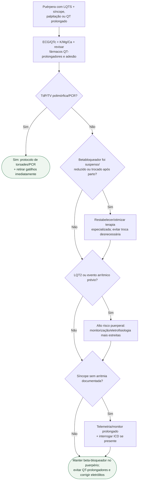

# LQTS no puerpério

```mermaid
flowchart TD
  R0["Puérpera com LQTS + síncope,<br/>palpitação ou QT prolongado"]
  P1["ECG/QTc + K/Mg/Ca + revisar<br/>fármacos QT-prolongadores e adesão"]
  D1{"TdP/TV polimórfica/PCR?"}
  C1(["Sim: protocolo de torsades/PCR<br/>+ retirar gatilhos imediatamente"])
  D2{"Betabloqueador foi suspenso/<br/>reduzido ou trocado após parto?"}
  P2["Restabelecer/otimizar terapia<br/>especializada; evitar troca desnecessária"]
  D3{"LQT2 ou evento arrítmico prévio?"}
  P3["Alto risco puerperal:<br/>monitorização/eletrofisiologia mais estreitas"]
  D4{"Síncope sem arritmia documentada?"}
  P4["Telemetria/monitor prolongado<br/>+ interrogar ICD se presente"]
  C2(["Manter beta-bloqueador no puerpério;<br/>evitar QT-prolongadores e corrigir eletrólitos"])

  R0 --> P1
  P1 --> D1
  D1 -->|"Sim"| C1
  D1 -->|"Não"| D2
  D2 -->|"Sim"| P2
  D2 -->|"Não"| D3
  P2 --> D3
  D3 -->|"Sim"| P3
  D3 -->|"Não"| D4
  P3 --> D4
  D4 -->|"Sim"| P4
  D4 -->|"Não"| C2
  P4 --> C2

  classDef conduta fill:#eef6ef,stroke:#2f7a4f,color:#12301f;
  class C1,C2 conduta;
```

## Regra prática

**LQT2 + puerpério é combinação de alto risco.** Não reduza proteção antiadrenérgica justamente quando a vulnerabilidade aumenta.