# LQTS no puerpério

```mermaid
flowchart TD
  R0["Puérpera com LQTS + síncope,<br/>palpitação ou QT prolongado"]
  P1["ECG/QTc + K/Mg/Ca + revisar<br/>fármacos QT-prolongadores e adesão"]
  D1{"TdP/TV polimórfica/PCR?"}
  C1(["Sim: protocolo de torsades/PCR<br/>+ retirar gatilhos imediatamente"])
  D2{"Betabloqueador foi suspenso/<br/>reduzido ou trocado após parto?"}
  P2["Restabelecer dose pré-gestacional/plena;<br/>propranolol ou nadolol são preferidos.<br/>Evitar troca abrupta após o parto"]
  D3{"LQT2 ou evento arrítmico prévio?"}
  P3["Alto risco até 12 meses pós-parto:<br/>manter dose plena + seguimento<br/>eletrofisiológico mais estreito"]
  D4{"Síncope sem arritmia documentada?"}
  P4["Telemetria/monitor prolongado<br/>+ interrogar ICD se presente"]
  D5{"Nadolol em dose alta<br/>durante amamentação?"}
  P5["Ponderar benefício/risco e monitorar<br/>lactente para bradicardia;<br/>não trocar automaticamente no pós-parto"]
  C2(["Manter betabloqueador; evitar QT-prolongadores<br/>e corrigir hipocalemia/hipomagnesemia"])
  C3(["Recém-nascido: ECG após o parto e com 2 semanas<br/>+ pesquisar cedo a variante familiar"])

  R0 --> P1
  P1 --> D1
  D1 -->|"Sim"| C1
  D1 -->|"Não"| D2
  C1 --> D2
  D2 -->|"Sim"| P2
  D2 -->|"Não"| D3
  P2 --> D3
  D3 -->|"Sim"| P3
  D3 -->|"Não"| D4
  P3 --> D4
  D4 -->|"Sim"| P4
  D4 -->|"Não"| D5
  P4 --> D5
  D5 -->|"Sim"| P5
  D5 -->|"Não"| C2
  P5 --> C2
  C2 --> C3

  classDef conduta fill:#eef6ef,stroke:#2f7a4f,color:#12301f;
  class C1,C2,C3 conduta;
```

## Regra prática

**LQT2 + puerpério é combinação de alto risco.** Não reduza proteção antiadrenérgica justamente quando a vulnerabilidade aumenta. Se um antiemético que prolonga QT for absolutamente necessário, usar monitorização eletrocardiográfica. A eventual troca de nadolol para propranolol por lactação deve ser planejada idealmente antes da gestação, não improvisada logo após o parto.
