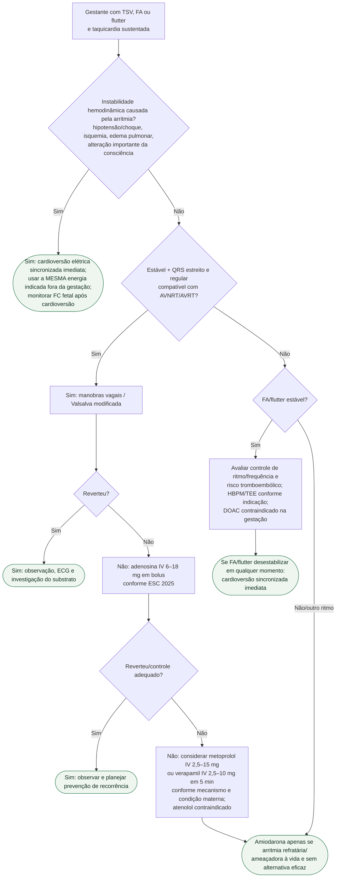

# Taquiarritmia na gestação

## Regra prática

**Instabilidade materna vence a preocupação com a gestação:** cardioverter sem atraso. Na estável com AVNRT/AVRT, Valsalva e adenosina são o caminho inicial recomendado pela ESC 2025.
