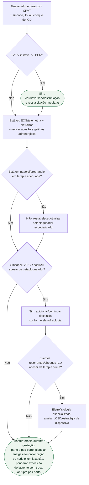

# CPVT na gestação/puerpério

## Regra prática

Na CPVT, **síncope durante estresse não é “só síncope”**. É um marcador de falha de proteção antiarrítmica até prova em contrário.

Nadolol e propranolol são escolhas da ESC para CPVT e devem ser continuados na
gestação e na lactação. A diferença prática é que o nadolol passa mais para o
leite; em dose alta, o lactente pode precisar de vigilância para bradicardia.
Isso deve ser planejado antes do parto sempre que possível — trocar o
betabloqueador abruptamente no pós-parto pode retirar proteção justamente numa
fase vulnerável.
