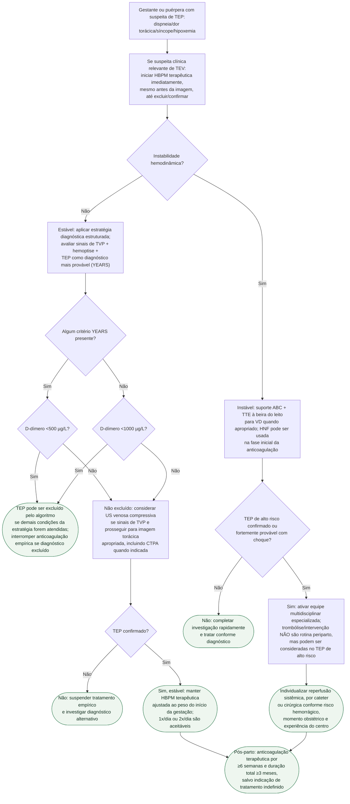

# TEP agudo na gestação e no puerpério

## Notas de segurança

O D-dímero não é interpretado isoladamente; os cortes de 500 e 1000 µg/L pertencem ao algoritmo YEARS adaptado descrito pela ESC 2025. Na instabilidade, não atrasar suporte e decisão de reperfusão aguardando uma sequência diagnóstica desenhada para pacientes estáveis.
