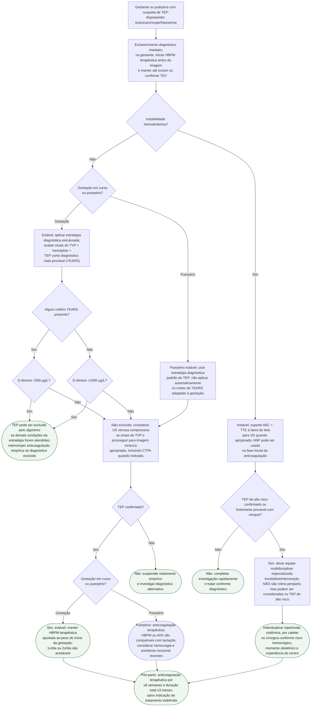

# TEP agudo na gestação e no puerpério

## Notas de segurança

O D-dímero não é interpretado isoladamente. Os cortes de 500 e 1000 µg/L
pertencem ao algoritmo YEARS adaptado à **gestação** descrito pela ESC 2025;
eles não devem ser transportados automaticamente ao puerpério. Na instabilidade,
não atrasar suporte e decisão de reperfusão aguardando uma sequência diagnóstica
desenhada para pacientes estáveis.

Na gestante com TEV confirmado, HBPM terapêutica é ajustada pelo peso do início
da gestação, em uma ou duas administrações diárias. Monitorização rotineira de
anti-Xa não melhora desfecho e só deve ser considerada em insuficiência renal ou
obesidade. Na instabilidade por TEP, HNF pode ser usada na fase inicial.

Trombólise ou intervenção não é rotina no periparto; só deve ser considerada no
TEP de alto risco após avaliação multidisciplinar especializada. Filtro de veia
cava fica restrito a TEV recorrente apesar de anticoagulação apropriada ou
contraindicação à dose terapêutica. Quem recebe anticoagulação terapêutica na
gestação precisa de parto planejado com interrupção prévia da HBPM, evitando
trabalho de parto espontâneo sob anticoagulação plena.

## Tudo com Tudo

- [YEARS adaptado e CT-PE Pregnancy](diagnostico-de-tep-na-gestante-years-adaptado-e-a-estrategia-do-ct-pe-pregnancy.md)
- [TEP na gestação e puerpério — revisão clínica](tromboembolismo-pulmonar-agudo-na-gestacao-e-puerperio-esc-2025.md)
- [Diagnóstico de TEP no adulto — ESC 2019](../Tromboembolismo/fluxograma-tromboembolismo-pulmonar-diagnostico-esc-2019.md)
- [Anticoagulantes na gestação e lactação](../Tromboembolismo/anticoagulantes-na-gestacao-e-lactacao-o-que-diz-a-bula-registrada.md)
- [Terapia dirigida por cateter no TEP](../Tromboembolismo/terapia-dirigida-por-cateter-no-tep-peerless-e-o-que-ainda-nao-esta-respondido.md)
- [Filtro de veia cava no TEP agudo — PREPIC2](../Tromboembolismo/filtro-de-veia-cava-inferior-recuperavel-no-tep-agudo-o-ensaio-prepic2.md)
