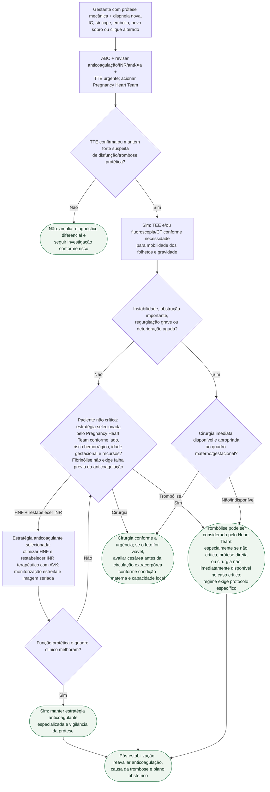

# Trombose de prótese mecânica na gestação

## Segurança

Trombose de prótese mecânica na gestação tem alta mortalidade materna. **Eco urgente e definição rápida de obstrução/instabilidade vêm antes da escolha entre cirurgia e trombólise.**

Na apresentação subaguda, otimizar anticoagulação com HNF e restabelecer INR
terapêutico com AVK pode ser suficiente, conforme a ESC 2025. Isso não deve
atrasar intervenção na trombose aguda com obstrução ou regurgitação grave nem
ser transformado em teste obrigatório antes de fibrinólise na paciente não
crítica.

Trombólise não é um ramo automático nem está restrita ao colapso sem cirurgião:
a diretriz permite considerá-la sobretudo em paciente não crítica — sem exigir
falha prévia da anticoagulação —, em trombose de prótese direita e quando
cirurgia não está imediatamente disponível para a paciente crítica. Local da
prótese, estabilidade, idade gestacional, risco de
sangramento e experiência do centro definem a decisão. Dose e velocidade não
são reproduzidas aqui porque dependem de protocolo especializado.

Circulação extracorpórea impõe risco fetal elevado. Quando cirurgia cardíaca é
necessária e o feto é viável, cesárea antes do procedimento oferece benefício de
sobrevida fetal sem aumento demonstrado de mortalidade materna na metanálise
citada pela diretriz; a decisão depende da urgência materna e dos recursos.

## Tudo com Tudo

- [Doença cardiovascular e gravidez — ESC 2025](fluxograma-doenca-cardiovascular-e-gravidez-esc-2025.md)
- [ROPAC III: anticoagulação e risco na prótese mecânica](ropac-iii-anticoagulacao-em-protese-valvar-mecanica-na-gestacao-dados-atualizados-de-risco.md)
- [Trombose de prótese mecânica na gestação — revisão clínica](trombose-de-protese-valvar-mecanica-na-gestacao.md)
- [Trombose de prótese mecânica: fibrinólise ou cirurgia](../Valvopatias/trombose-de-protese-valvar-mecanica-diagnostico-e-decisao-entre-fibrinolise-e-cirurgia.md)
- [Sangramento maior em paciente anticoagulado](../Tromboembolismo/fluxograma-sangramento-maior-em-paciente-anticoagulado.md)
