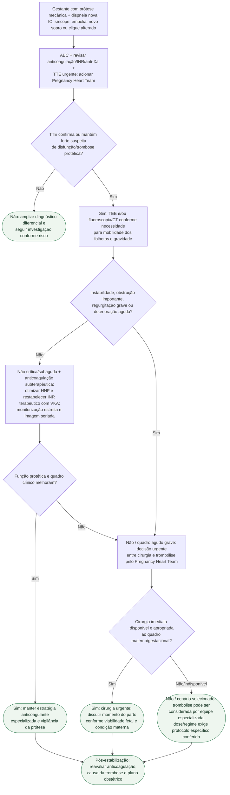

# Trombose de prótese mecânica na gestação

## Segurança

Trombose de prótese mecânica na gestação tem alta mortalidade materna. **Eco urgente e definição rápida de obstrução/instabilidade vêm antes da escolha entre cirurgia e trombólise.**
