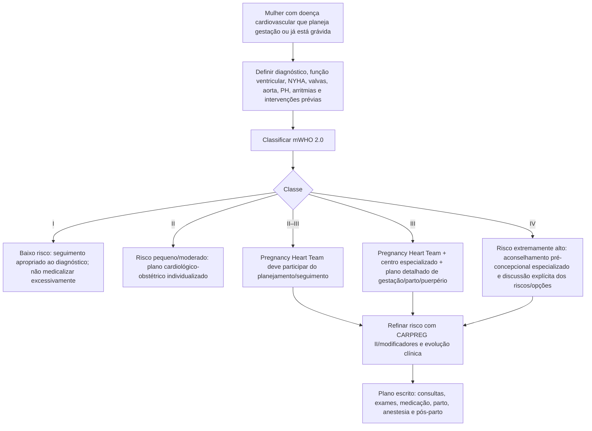
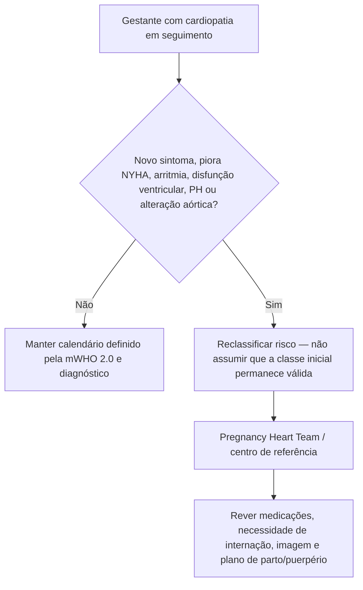

# mWHO 2.0 — estratificação de risco cardiovascular materno na ESC 2025

## O papel da classificação

A ESC 2025 atualizou a classificação modified World Health Organization para **mWHO 2.0**. Ela organiza o risco materno cardiovascular em cinco classes: I, II, II–III, III e IV, devendo ser usada para selecionar intensidade de seguimento e necessidade de Pregnancy Heart Team.

A classificação é um ponto de partida, não um substituto da avaliação individual. A própria diretriz recomenda refinar a estimativa com modificadores clínicos, incluindo preditores do CARPREG II.

## Classes de risco

| Classe | Interpretação geral |
|---|---|
| mWHO I | Sem aumento detectável de mortalidade materna e aumento nulo/leve de morbidade |
| mWHO II | Pequeno aumento de mortalidade materna ou aumento moderado de morbidade |
| mWHO II–III | Aumento intermediário de mortalidade e morbidade moderada a grave |
| mWHO III | Aumento significativo de mortalidade ou morbidade grave |
| mWHO IV | Risco extremamente alto de mortalidade materna ou morbidade grave |

A tabela da ESC cita taxas médias observadas de eventos cardíacos que aumentam progressivamente entre as classes, mas elas variam entre coortes e **não devem ser usadas como probabilidade individual isolada**.

## Exemplos cardiovasculares da mWHO 2.0

### Função ventricular / hipertensão pulmonar

- disfunção leve de VE: **FE >45%** aparece em classe de menor risco intermediário;
- disfunção moderada: **FE 30–45%** aumenta a classe de risco;
- disfunção grave: **FE <30% ou NYHA III/IV** é classificada como risco extremamente alto;
- **hipertensão arterial pulmonar** está no grupo de risco mais alto.

### Cardiomiopatias

- HCM genótipo positivo/fenótipo negativo e HCM sem complicações ocupam classes inferiores;
- HCM com complicações arrítmicas/hemodinâmicas aumenta risco;
- HCM com obstrução sintomática grave da VSVE **≥50 mmHg** ou disfunção ventricular importante é classificada em nível elevado.

### Cardiopatias congênitas

A classificação diferencia lesões simples reparadas sem sequelas relevantes de situações complexas:

- lesões simples corrigidas sem repercussão significativa → baixo risco;
- Fontan sem complicações, ventrículo sistêmico direito bem preservado e outras lesões estáveis → risco intermediário conforme fenótipo;
- Fontan com complicações, ventrículo sistêmico direito moderada/grave disfunção e cardiopatia cianótica aumentam risco;
- **síndrome de Eisenmenger** é mWHO IV.

### Valvopatias

- lesões leves → classes inferiores;
- estenose mitral moderada, estenose aórtica grave assintomática e regurgitação esquerda grave elevam o risco;
- **estenose mitral grave** e **estenose aórtica grave sintomática** estão entre os fenótipos de risco máximo.

### Aortopatias

O risco depende de etiologia e diâmetro. Exemplos de alto risco/mWHO IV incluem:

- Marfan/outra doença hereditária da aorta com diâmetro **>45 mm**;
- BAV com aorta **>50 mm**;
- Turner com ASI **>25 mm/m²**;
- outras dilatações aórticas **>50 mm**;
- síndrome vascular de Ehlers–Danlos;
- dissecção prévia com aumento progressivo de diâmetro.

## Árvore de decisão: pré-concepção ou primeira avaliação gestacional

## Pregnancy Heart Team

A ESC 2025 reforça que o cuidado da Pregnancy Heart Team começa **antes da concepção** e continua até o **puerpério**. A equipe central deve ser expandida conforme o fenótipo, podendo incluir especialistas em:

- insuficiência cardíaca;
- arritmias/eletrofisiologia;
- cardiomiopatias;
- valvopatias;
- cardiopatia congênita do adulto;
- hipertensão pulmonar;
- aortopatias/genética;
- cardiologia intervencionista/isquêmica;
- cirurgia cardíaca/vascular;
- anestesia e medicina materno-fetal.

## Árvore: quando intensificar acompanhamento

## Modificadores de risco

A tabela mWHO 2.0 recomenda individualizar a classe com modificadores derivados do CARPREG II. Entre os preditores citados pela ESC estão:

- disfunção ventricular;
- doença valvar esquerda/outflow obstruction de alto risco;
- hipertensão pulmonar;
- doença coronariana;
- avaliação tardia durante a gravidez;
- ausência de intervenção prévia quando indicada.

O score CARPREG II completo deve ser calculado apenas por implementação validada; não reproduzir pontuação parcial como se fosse o escore integral.

## Armadilhas

1. Não usar mWHO 2.0 como probabilidade matemática individual.
2. Não manter a classe inicial quando o fenótipo piora durante a gravidez.
3. Não planejar apenas o parto; o risco pode permanecer alto no pós-parto.
4. Não chamar toda cardiopatia congênita de alto risco: anatomia, reparo e sequelas hemodinâmicas importam.
5. Não aconselhar gestação com base apenas na FEVE sem considerar NYHA, PH, valvas, aorta e arritmias.

## Fonte verificada

De Backer J, Haugaa KH, Hasselberg NE, et al. 2025 ESC Guidelines for the management of cardiovascular disease and pregnancy. *Eur Heart J.* 2025;46(43):4462-4568. PMID **40878294**. DOI **10.1093/eurheartj/ehaf193**. Correction: DOI **10.1093/eurheartj/ehaf1011**.

## Status de revisão

`VERIFICAÇÃO HUMANA NECESSÁRIA`: antes de converter a tabela mWHO 2.0 em calculadora automática, transcrever e auditar individualmente todas as condições/colunas da tabela oficial e os modificadores do CARPREG II.
