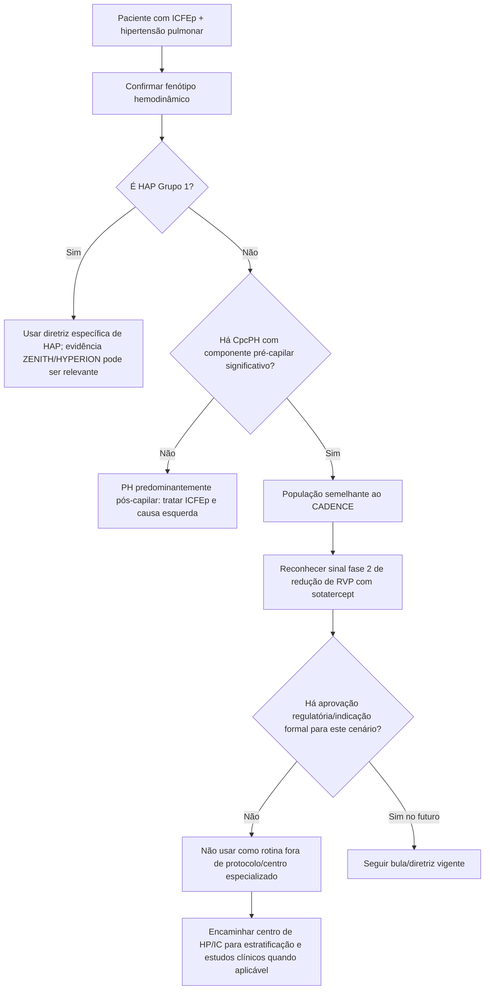

# CADENCE 2026 — sotatercept na CpcPH associada à ICFEp

O **CADENCE** é um estudo de prova de conceito particularmente importante porque testou sotatercept fora da hipertensão arterial pulmonar (HAP Grupo 1), em pacientes com **hipertensão pulmonar combinada pós- e pré-capilar (CpcPH) associada à ICFEp**, um fenótipo de pior prognóstico e sem terapia específica aprovada que modifique de forma comprovada a vasculopatia pulmonar.

## População

Ensaio multicêntrico, randomizado, placebo-controlado, fase 2.

Foram randomizados **164 pacientes**:

- sotatercept 0,3 mg/kg: 54;
- sotatercept 0,7 mg/kg: 55;
- placebo: 55;
- administração a cada 3 semanas;
- tratamento de base para ICFEp mantido.

Características basais divulgadas:

- idade média ~75 anos;
- cerca de 70% mulheres;
- resistência vascular pulmonar (RVP) mediana **5,2 Wood units**;
- pressão média da artéria pulmonar ~43 mmHg;
- pressão de oclusão/capilar pulmonar ~21 mmHg.

O estudo selecionou pacientes com componente pré-capilar relevante, incluindo RVP elevada, para enriquecer uma população com remodelamento vascular pulmonar potencialmente tratável.

## Desfecho primário

O desfecho primário foi mudança da **resistência vascular pulmonar em 24 semanas**.

Mudança mediana versus basal:

- 0,3 mg/kg: aproximadamente **−0,67 WU**;
- 0,7 mg/kg: aproximadamente **−0,33 WU**;
- placebo: aproximadamente **+0,26 WU**.

Estimativa placebo-ajustada para o braço 0,3 mg/kg:

- aproximadamente **−1,02 WU**;
- IC95% **−1,81 a −0,23**;
- **P=0,004**.

No braço 0,7 mg/kg, a redução placebo-ajustada também foi significativa, porém numericamente menor.

## Outros achados

Foram observadas reduções de pressão pulmonar e sinais de melhora hemodinâmica cardíaca/pulmonar. O estudo também avaliou capacidade funcional e outros desfechos, mas foi um ensaio fase 2 relativamente pequeno e com **24 semanas** de comparação controlada.

O objetivo principal foi demonstrar sinal biológico/hemodinâmico, não provar redução de mortalidade ou hospitalização.

## Por que isso é diferente de ZENITH/HYPERION

### ZENITH/HYPERION

- população: **HAP Grupo 1**;
- fisiopatologia predominantemente pré-capilar;
- sotatercept adicionado a terapia específica de HAP;
- desfechos clínicos de piora em populações de risco alto ou diagnóstico recente.

### CADENCE

- população: **Grupo 2**, ligada à ICFEp;
- há componente **pós-capilar obrigatório** + componente pré-capilar relevante;
- fisiologia envolve coração esquerdo e vasculatura pulmonar;
- estudo fase 2, prova de conceito, com desfecho hemodinâmico.

Portanto, não se deve aplicar o algoritmo de HAP Grupo 1 diretamente à CpcPH-ICFEp.

## Árvore de aplicabilidade

## O que NÃO concluir

- Não afirmar que sotatercept está estabelecido para toda hipertensão pulmonar Grupo 2.
- Não extrapolar CADENCE para PH pós-capilar isolada sem componente pré-capilar relevante.
- Não usar a melhora de RVP como prova de benefício de mortalidade.
- Não assumir relação dose-resposta linear apenas porque dois braços de dose foram testados.
- Não substituir tratamento de ICFEp por terapia vascular pulmonar experimental.
- Não confundir os critérios de inclusão do CADENCE com a definição universal de CpcPH em todas as diretrizes.

## Segurança e dose

O estudo empregou doses de 0,3 e 0,7 mg/kg a cada 3 semanas. Isso **não constitui recomendação assistencial para CpcPH-ICFEp**.

Prescrição nesse cenário permanece: **VERIFICAÇÃO HUMANA NECESSÁRIA** quanto a aprovação regulatória, bula e diretriz vigente.

## Regra prática

**CADENCE abre uma nova hipótese terapêutica em CpcPH-ICFEp, mas ainda não transforma Grupo 2 em HAP.** O resultado é forte como sinal hemodinâmico de fase 2 e deve levar a confirmação em estudos fase 3 antes de incorporação rotineira.