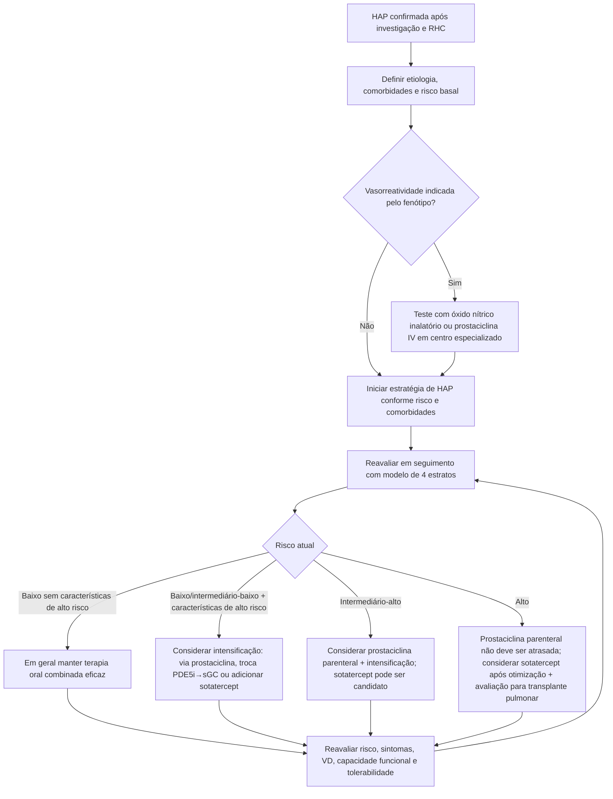
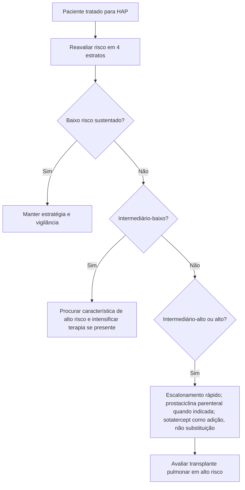

# HAP em 2025: risco, terapia combinada e sotatercept

## Contexto

O roundtable científico conjunto American Lung Association/Pulmonary Hypertension Association publicado em 2025 revisou criticamente a diretriz ESC/ERS 2022 e os proceedings do **7º World Symposium on Pulmonary Hypertension (2024)**, propondo uma integração prática das recomendações contemporâneas — inclusive a incorporação do **sotatercept**, aprovado nos EUA para adultos com HAP em março de 2024.

A principal mensagem é que HAP deve ser tratada de forma **orientada por risco e reavaliada dinamicamente**, e não por uma sequência fixa de fármacos.

## Estratificação em quatro estratos

No seguimento, o modelo de quatro estratos divide o antigo grupo intermediário em:

- baixo risco;
- intermediário-baixo;
- intermediário-alto;
- alto risco.

A estratificação deve integrar mais do que classe funcional isolada e ser aplicada de forma consistente ao longo do seguimento.

## Árvore de decisão: HAP confirmada

## Onde o sotatercept entra

O painel foi explícito em três pontos:

1. **não há evidência para sotatercept como tratamento de primeira linha isolado**;
2. deve ser considerado como parte de **terapia combinada** em pacientes que não atingem ou não mantêm baixo risco com a terapia inicial;
3. em pacientes de **alto risco**, sotatercept **não deve atrasar** a otimização de terapia de base, incluindo prostaciclina parenteral quando indicada.

A terapia de transplante pulmonar também não deve ser abandonada simplesmente porque sotatercept foi iniciado.

## Segurança do sotatercept

O painel ressalta seguir rigorosamente a bula e monitorar eventos adversos, incluindo:

- trombocitopenia;
- eritrocitose;
- aumento de risco hemorrágico;
- telangiectasias.

Não existe evidência suficiente para recomendar desescalonamento rotineiro das demais terapias de HAP após adicionar sotatercept.

## HAP com baixo débito

Em paciente com **baixo débito cardíaco**, o painel reforça considerar prostaciclina parenteral. Em alto risco, não se deve substituir essa estratégia por sotatercept esperando resposta futura.

## Grupo 3: PH associada a doença intersticial pulmonar

O roundtable reconhece benefício de **treprostinil inalatório** em PH associada a ILD quando **PVR >3 WU**, após excluir contribuição relevante de doença cardíaca esquerda e distinguir PH causada predominantemente pela doença pulmonar de HAP coexistente.

Essa distinção importa porque terapia de HAP não deve ser aplicada indiscriminadamente a todo paciente com doença pulmonar + PH.

## CTEPH / Grupo 4

Para doença tromboembólica pulmonar crônica com PH:

- todo paciente potencialmente operável deve ser avaliado por centro experiente para **endarterectomia pulmonar (PEA)**;
- **angioplastia pulmonar por balão (BPA)** é opção para pacientes inadequados para PEA ou em cenários selecionados;
- estimulador de guanilato ciclase solúvel é opção quando PEA/BPA não são apropriadas ou em PH residual, conforme cenário e disponibilidade.

## Árvore rápida: intensificar ou observar?

## Armadilhas

- Não tratar algoritmo como substituto do julgamento de centro especializado.
- Não classificar risco apenas por NYHA/WHO-FC.
- Não usar sotatercept para postergar prostaciclina parenteral em alto risco.
- Não retirar automaticamente ERA/PDE5i/prostaciclina após resposta ao sotatercept.
- Não tratar PH por doença pulmonar como se fosse HAP idiopática sem fenotipagem adequada.

## Fonte verificada

Kolaitis NA, Sahay S, Berman Rosenzweig E, et al. American Lung Association Pulmonary Hypertension Roundtable: Executive Summary. *Pulm Circ.* 2025;15(4):e70200. PMID **41245392**. PMCID **PMC12617243**. DOI **10.1002/pul2.70200**.

## Status de revisão

`VERIFICAÇÃO HUMANA NECESSÁRIA`: converter recomendações em classe/nível formal apenas após conferência contra a diretriz/regra institucional adotada; este roundtable é consenso especializado e não substitui a diretriz ESC/ERS formal.
