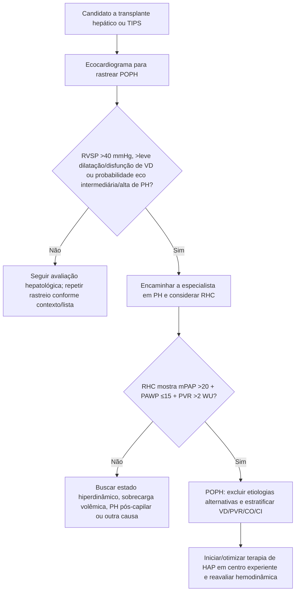
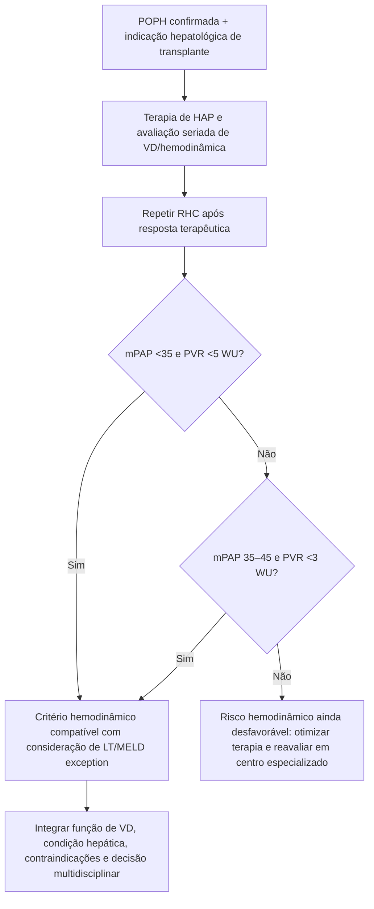

# Hipertensão portopulmonar (POPH) — guideline ILTS 2025/2026

## Definição atual

A atualização da International Liver Transplantation Society (ILTS), publicada online em 2025 e em fascículo de 2026, define POPH pela combinação de:

- **hipertensão portal**;
- **hipertensão pulmonar pré-capilar** sem outra etiologia que explique melhor o quadro;
- **mPAP >20 mmHg**;
- **PVR >2 WU**;
- **PAWP ≤15 mmHg**;

confirmadas por **cateterismo cardíaco direito (RHC)**.

A mudança do limiar de PVR de >3 para >2 WU acompanha ESC/ERS 2022 e o 7º World Symposium on Pulmonary Hypertension. Importante: a evidência dos fármacos de HAP foi construída em populações com critérios hemodinâmicos mais antigos e mais graves; portanto, o benefício da terapia específica nos casos mais leves definidos apenas pelos novos cortes não está estabelecido.

## Gravidade hemodinâmica por mPAP

| Gravidade | mPAP |
|---|---:|
| Leve | >20 e <35 mmHg |
| Moderada | 35 a <45 mmHg |
| Grave | ≥45 mmHg |

A própria diretriz alerta que **mPAP não deve ser interpretada isoladamente**: débito cardíaco hiperdinâmico, sobrecarga volêmica, PVR e função do VD mudam o significado prognóstico.

## Árvore: triagem do candidato a transplante hepático/TIPS

A ILTS recomenda que **todos os candidatos a transplante hepático e TIPS sejam rastreados com ecocardiograma**. Enquanto aguardam transplante, é considerada razoável reavaliação ecocardiográfica anual, reconhecendo a limitação da evidência.

## Um erro histórico: usar mPAP >35 mmHg isoladamente para negar transplante

Dados antigos associaram mPAP >35 mmHg e PVR elevada a mortalidade perioperatória muito alta. Entretanto, coortes modernas mostram que mPAP >35 mmHg pode refletir alto débito e não necessariamente resistência vascular pulmonar perigosa.

A atualização ressalta que **mPAP >35 mmHg com PVR normal/baixa e função de VD satisfatória não deve, isoladamente, impedir transplante hepático**.

PVR permanece um marcador prognóstico importante: na série citada pela ILTS, **PVR >3 WU** associou-se a risco de morte pós-transplante quase três vezes maior.

## Critérios hemodinâmicos pós-tratamento para considerar transplante com MELD exception

A ILTS recomenda considerar transplante hepático com MELD exception em pacientes adequados, sem outra contraindicação ao transplante, que após terapia de HAP atinjam **uma das duas combinações**:

1. **mPAP <35 mmHg e PVR <5 WU**, ou
2. **mPAP 35–45 mmHg e PVR <3 WU**.

## Árvore: terapia → elegibilidade para transplante

## Intraoperatório do transplante

A ILTS recomenda, na ausência de contraindicação:

- monitorização hemodinâmica invasiva com **cateter de artéria pulmonar**;
- **ecocardiograma transesofágico** por equipe experiente;
- manter terapias de HAP IV/subcutâneas durante o procedimento;
- manter medicações orais no pré-operatório conforme viabilidade;
- em colapso cardiovascular por falência aguda de VD, **VA-ECMO** pode ser utilizado como resgate onde disponível e apropriado.

## Pós-transplante

- avaliação clínica + ecocardiograma por especialista de PH em até **3 meses** após transplante, ou antes se indicado;
- não assumir que o transplante “curou” imediatamente a POPH;
- redução de terapia específica deve ser lenta, ambulatorial e em geral **não antes de 3–6 meses**, guiada por clínica, TTE e eventualmente RHC;
- quando possível, prostaciclina IV/subcutânea é retirada primeiro de modo gradual, seguida das terapias orais/inaladas conforme resposta.

## RHC continua indispensável

Em hepatopatia, mPAP elevada pode resultar de:

- estado hiperdinâmico;
- sobrecarga volêmica;
- POPH verdadeira;
- doença cardíaca esquerda.

O ecocardiograma seleciona quem precisa avançar, mas **não substitui RHC para diagnóstico de POPH**.

## Armadilhas

1. Não diagnosticar POPH apenas por ecocardiograma.
2. Não negar transplante apenas porque mPAP é >35 mmHg sem olhar PVR, débito e VD.
3. Não interpretar PVR 2–3 WU como necessariamente benigna: a diretriz cita progressão frequente em pequenas coortes e recomenda acompanhamento próximo.
4. Não suspender terapia de HAP abruptamente após transplante.
5. Não confundir POPH com síndrome hepatopulmonar — são fisiopatologias e estratégias distintas.

## Fonte verificada

DuBrock HM, Savale L, Sitbon O, et al. International Liver Transplantation Society practice guideline update on portopulmonary hypertension. *Liver Transpl.* 2026;32(2):296-314. Epub 2025 Mar 18. PMID **40094355**. PMCID **PMC12799263**. DOI **10.1097/LVT.0000000000000600**.

## Status de revisão

`VERIFICAÇÃO HUMANA NECESSÁRIA`: antes de uso assistencial institucional, confirmar políticas locais/nacionais de lista e MELD exception, pois os critérios administrativos variam entre sistemas de transplante mesmo quando a fisiologia hemodinâmica é a mesma.
