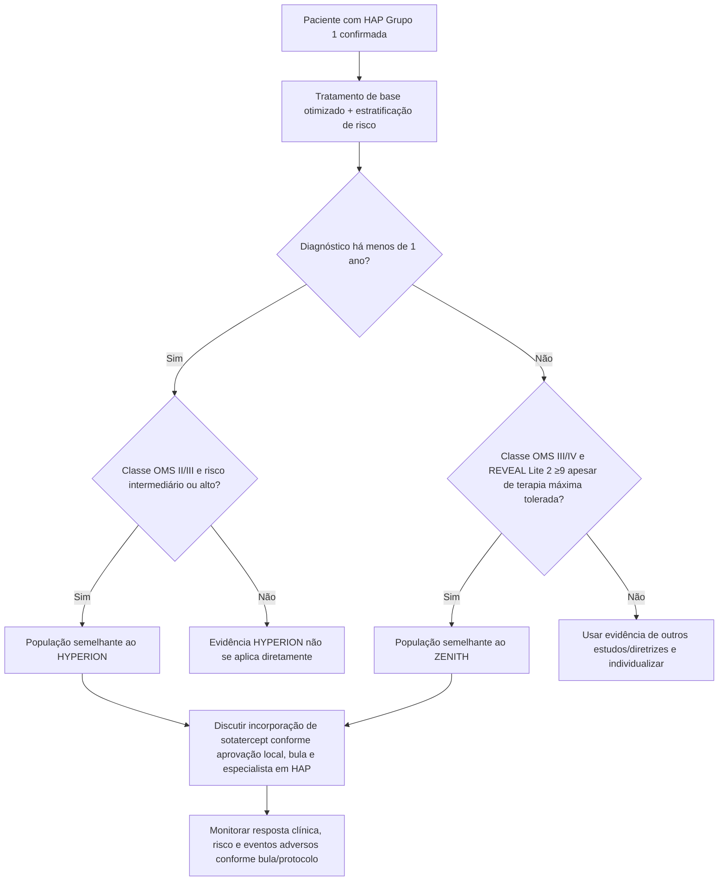

# Sotatercept na HAP — ZENITH e HYPERION 2025

Os ensaios **ZENITH** e **HYPERION** expandiram em 2025 a evidência do sotatercept para dois cenários complementares de hipertensão arterial pulmonar (HAP): pacientes já em alto risco de morte apesar de terapia de base intensiva e pacientes com diagnóstico recente, ainda no primeiro ano de doença.

O ponto clínico principal é que a evidência deixou de estar concentrada apenas em capacidade de exercício ou hemodinâmica: ambos os estudos avaliaram desfechos de **piora clínica**, hospitalização, transplante e/ou morte.

## ZENITH — HAP de alto risco apesar de tratamento

### População

Adultos com HAP em classe funcional OMS III ou IV, risco elevado de morte em 1 ano pelo **REVEAL Lite 2 ≥9**, em dose máxima tolerada de terapia de base.

### Resultado primário

O estudo foi interrompido precocemente por eficácia em análise interina pré-especificada.

O desfecho composto de **morte por qualquer causa, transplante pulmonar ou hospitalização ≥24 h por piora da HAP** ocorreu em:

- **17,4%** com sotatercept;
- **54,7%** com placebo;
- **HR 0,24; IC95% 0,13–0,43; P<0,001**.

Componentes relatados no artigo:

- morte por qualquer causa: 8,1% versus 15,1%;
- transplante pulmonar: 1,2% versus 7,0%;
- hospitalização por piora da HAP: 9,3% versus 50,0%.

Os eventos adversos mais frequentes associados ao sotatercept incluíram epistaxe e telangiectasia.

## HYPERION — HAP diagnosticada há menos de 1 ano

### População

Adultos em classe funcional OMS II ou III, com diagnóstico de HAP havia menos de 1 ano, risco intermediário ou alto de morte e já recebendo terapia dupla ou tripla de base.

### Resultado primário

O estudo também foi encerrado precocemente após perda de equilíbrio clínico decorrente do conjunto de evidências positivas do programa de sotatercept.

Piora clínica ocorreu em:

- **10,6%** com sotatercept;
- **36,9%** com placebo;
- **HR 0,24; IC95% 0,14–0,41; P<0,001**.

Entre os componentes:

- piora do desempenho no teste de exercício: 5,0% versus 28,8%;
- hospitalização não planejada por HAP: 1,9% versus 8,8%;
- morte: 4,4% versus 3,8%.

A diferença no componente morte isoladamente não deve ser interpretada como dano ou ausência de benefício de mortalidade: o estudo não foi desenhado nem dimensionado para demonstrar diferença isolada nesse componente.

## O que os dois estudos juntos acrescentam

ZENITH e HYPERION cobrem dois extremos temporalmente diferentes:

- **ZENITH:** doença estabelecida, avançada e de alto risco apesar de tratamento;
- **HYPERION:** fase precoce, dentro do primeiro ano de diagnóstico, mas já com risco intermediário/alto.

O efeito relativo do desfecho primário foi muito semelhante nos dois ensaios, com HR de **0,24** em ambos, embora os compostos e populações não sejam idênticos.

Não comparar percentuais brutos entre os dois estudos como se fossem uma única coorte.

## Árvore de aplicabilidade — onde a evidência de 2025 se encaixa

## O que NÃO concluir

- Não extrapolar ZENITH para todas as formas de hipertensão pulmonar: o estudo é HAP Grupo 1.
- Não usar HYPERION para afirmar benefício comprovado em HAP de baixo risco.
- Não substituir terapia de base pelas evidências de sotatercept; os estudos avaliaram **adição** ao tratamento de fundo.
- Não inferir dose clínica atual somente a partir do protocolo dos ensaios.
- Não assumir que HR 0,24 significa redução absoluta de 76 pontos percentuais.

## Dose e prescrição

A posologia atual deve seguir a **bula aprovada no país, hemoglobina/plaquetas e critérios de monitorização correspondentes**. Dose clínica operacional neste documento: **VERIFICAÇÃO HUMANA NECESSÁRIA** contra a bula brasileira vigente antes de publicação assistencial.

## Regra prática

**Em 2025, sotatercept deixou de ser apenas uma terapia associada a melhora funcional e passou a ter evidência de redução importante de eventos de piora clínica tanto em HAP de alto risco estabelecida quanto em HAP de diagnóstico recente com risco intermediário/alto.**