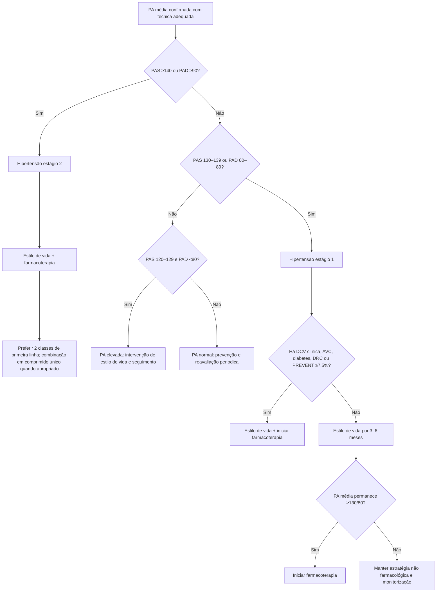
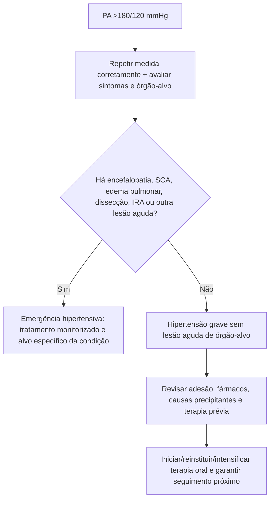

# Diretriz AHA/ACC 2025 de hipertensão

A atualização AHA/ACC 2025 substitui a diretriz de 2017 e mantém as categorias de pressão arterial, mas muda pontos importantes da decisão terapêutica, especialmente ao integrar o **PREVENT** na definição de risco cardiovascular que orienta quando iniciar medicamento em pacientes com PA na faixa de estágio 1.

## Classificação da pressão arterial

- **Normal:** PAS <120 **e** PAD <80 mmHg.
- **Elevada:** PAS 120–129 e PAD <80 mmHg.
- **Hipertensão estágio 1:** PAS 130–139 **ou** PAD 80–89 mmHg.
- **Hipertensão estágio 2:** PAS ≥140 **ou** PAD ≥90 mmHg.

## Meta geral

A diretriz estabelece como objetivo global de tratamento **PA <130/80 mmHg** para adultos, com individualização em situações como expectativa de vida limitada, institucionalização e gestação.

## Quem deve iniciar farmacoterapia

Além de intervenção de estilo de vida, tratamento medicamentoso é recomendado para:

- PA média **≥140/90 mmHg**;
- PA média **≥130/80 mmHg** com doença cardiovascular clínica;
- AVC prévio;
- diabetes;
- doença renal crônica;
- risco cardiovascular em 10 anos pelo **PREVENT ≥7,5%**.

Em paciente com PA ≥130/80 mmHg e PREVENT <7,5%, sem as condições de alto risco acima, a diretriz recomenda inicialmente mudança de estilo de vida; se após **3–6 meses** a PA média permanecer ≥130/80 mmHg, deve-se iniciar farmacoterapia.

## Estágio 2: começar com combinação

Para hipertensão estágio 2, a diretriz prefere iniciar **dois agentes de primeira linha de classes diferentes**, idealmente em combinação de dose fixa de comprimido único, para melhorar adesão e acelerar controle.

Este documento não especifica doses farmacológicas: dose e escolha exata devem seguir a bula e o perfil clínico individual.

## Monitorização domiciliar

A diretriz reforça monitorização domiciliar de PA com técnica padronizada e interação frequente com equipe multiprofissional. Dispositivos **cuffless**, incluindo smartwatches, não devem ser usados como substitutos de medida validada de PA até demonstrarem acurácia suficiente.

## Hipertensão grave sem lesão aguda de órgão-alvo

Em paciente não gestante com **PA >180/120 mmHg sem lesão aguda de órgão-alvo**, a diretriz diferencia o cenário de emergência hipertensiva e recomenda avaliação e intensificação/reintrodução de terapia oral em tempo oportuno, geralmente em ambiente ambulatorial, conforme contexto clínico.

Se houver lesão aguda de órgão-alvo, o caso deixa de ser simples hipertensão grave e deve ser conduzido como emergência hipertensiva.

## Árvore de decisão — quando tratar farmacologicamente

## Árvore de decisão — PA >180/120 mmHg

## Principais mudanças práticas

1. PREVENT passa a ser o instrumento de risco preferido para a decisão na faixa 130–139/80–89 mmHg.
2. O corte de risco usado para indicar farmacoterapia é **≥7,5% em 10 anos**.
3. Estágio 2 favorece combinação inicial de duas classes.
4. Monitorização domiciliar é parte do tratamento, mas smartwatch sem cuff não substitui aparelho validado.
5. PA >180/120 sem lesão aguda de órgão-alvo não deve ser automaticamente tratada como emergência IV.

## Regra prática

**A PA define o estágio; o risco define a urgência de tratar.** Na hipertensão estágio 1, PREVENT e comorbidades cardiovasculares determinam se a farmacoterapia começa agora ou após uma tentativa estruturada de 3–6 meses de intervenção de estilo de vida.