# Fluxograma: Aldosteronismo Primário Confirmado — Subtipagem e Decisão entre Cirurgia e MRA

O protocolo de testes confirmatórios já publicado nesta pasta chega até o diagnóstico bioquímico de aldosteronismo primário (relação aldosterona-renina alterada, confirmada por infusão salina, fludrocortisona, captopril ou sobrecarga de sódio). Mas o diagnóstico bioquímico não diz, sozinho, qual tratamento oferecer: cerca de 30% dos pacientes têm doença **unilateral**, curável por adrenalectomia, e 70% têm doença **bilateral**, que não se beneficia de cirurgia e deve ser tratada com antagonista do receptor mineralocorticoide (Ragnarsson et al. 2026, PMID 41467368). A TC de adrenais sozinha erra a lateralidade em mais de um terço dos casos — por isso a amostragem de veia adrenal (AVS) segue sendo o padrão-ouro para quem é candidato cirúrgico, exceto num subgrupo restrito de pacientes jovens com achados típicos. Este fluxograma organiza essa sequência de decisão, que faltava nesta biblioteca.

## Árvore de decisão

```mermaid
flowchart TD
  R0["Paciente com diagnóstico bioquímico confirmado de aldosteronismo primário<br/>(relação aldosterona-renina alterada + teste confirmatório positivo — ver<br/>protocolo de testes confirmatórios já publicado nesta pasta)"]
  R0 --> D1{"Paciente é candidato a tratamento cirúrgico?<br/>(aceita adrenalectomia se doença unilateral for confirmada<br/>e tem condição clínica para cirurgia)"}
  D1 -->|"Não — recusa cirurgia, risco cirúrgico proibitivo<br/>ou expectativa de vida limitada"| C1(["Não candidato a cirurgia: tratamento medicamentoso com<br/>antagonista do receptor mineralocorticoide (espironolactona<br/>como primeira escolha; eplerenona como alternativa se efeitos<br/>antiandrogênicos forem limitantes), sem necessidade de TC<br/>ou AVS para subtipagem"])
  D1 -->|"Sim — candidato a cirurgia caso doença<br/>unilateral seja confirmada"| P1["Solicitar TC de adrenais com cortes finos: define anatomia,<br/>ajuda a excluir carcinoma adrenocortical e planeja a cirurgia,<br/>mas NÃO deve, isoladamente, decidir lateralidade — TC/RM<br/>classificam mal mais de 1/3 dos pacientes (Ragnarsson et al. 2026)"]
  P1 --> D2{"TC mostra adenoma adrenal unilateral solitário maior<br/>que 1cm, com glândula contralateral de aspecto normal, EM<br/>paciente com menos de 35 anos, aldosterona muito elevada<br/>e hipopotassemia espontânea/grave?<br/>(exceção da diretriz que permite dispensar AVS)"}
  D2 -->|"Sim — preenche todos os critérios<br/>simultaneamente"| C2(["Critérios da exceção preenchidos: pode prosseguir direto<br/>para adrenalectomia laparoscópica unilateral, sem necessidade<br/>de amostragem de veia adrenal (Funder et al. 2016; da Cunha<br/>Brito et al. 2026)"])
  D2 -->|"Não preenche todos os critérios<br/>ao mesmo tempo"| P2["Encaminhar para amostragem de veia adrenal (AVS) em<br/>centro com experiência no procedimento — indicação padrão<br/>para candidato cirúrgico fora da exceção acima"]
  P2 --> D3{"AVS tecnicamente bem-sucedida?<br/>(cateterização de ambas as veias adrenais confirmada pelo<br/>índice de seletividade definido no protocolo do centro)"}
  D3 -->|"Não — cateterização de uma ou ambas<br/>as veias adrenais malsucedida"| C3(["AVS tecnicamente malsucedida: repetir o procedimento em<br/>centro de referência antes de decidir; se permanecer<br/>malsucedida, decisão individualizada em centro especializado,<br/>com base em imagem e quadro clínico, reconhecendo o risco<br/>de erro de mais de 1/3 usando só TC/RM"])
  D3 -->|"Sim — cateterização bilateral<br/>tecnicamente adequada"| D4{"Índice de lateralização (conforme o protocolo do centro)<br/>indica predomínio de secreção de aldosterona<br/>em um dos lados?"}
  D4 -->|"Não — sem lateralização clara,<br/>achado compatível com doença bilateral"| C5(["Sem lateralização demonstrada: aldosteronismo primário<br/>bilateral (cerca de 70% dos casos) — tratamento medicamentoso<br/>com antagonista do receptor mineralocorticoide (espironolactona<br/>primeira escolha; eplerenona se efeitos antiandrogênicos<br/>limitantes), sem indicação cirúrgica (Ragnarsson et al. 2026)"])
  D4 -->|"Sim — lateralização evidente<br/>para um dos lados"| P3["Antes da cirurgia, otimizar PA para meta menor que<br/>140/90mmHg e corrigir potássio com antagonista do receptor<br/>mineralocorticoide em todos os pacientes — favorece a<br/>recuperação da função adrenal contralateral e reduz risco<br/>perioperatório (da Cunha Brito et al. 2026)"]
  P3 --> C4(["Aldosteronismo primário unilateral confirmado (cerca de<br/>30% dos casos): adrenalectomia laparoscópica unilateral —<br/>desfecho clínico superior ao tratamento medicamentoso a longo<br/>prazo; acompanhar com critérios PASO em 6-12 meses<br/>(Ragnarsson et al. 2026; da Cunha Brito et al. 2026)"])
  classDef conduta fill:#eef6ef,stroke:#2f7a4f,color:#12301f;
  class C1,C2,C3,C4,C5 conduta;
```

## Por que a TC de adrenais não decide sozinha

A TC de adrenais é indicada para todo candidato cirúrgico — ela define anatomia, ajuda a excluir carcinoma adrenocortical e orienta o planejamento da via de acesso —, mas usá-la isoladamente para decidir qual lado operar é um erro reconhecido pela literatura: segundo a revisão de Ragnarsson et al. (J Intern Med. 2026;299(2):178-195, PMID 41467368), **TC/RM classificam mal mais de um terço dos pacientes** com aldosteronismo primário unilateral verdadeiro, porque incidentalomas não funcionantes e hiperplasia bilateral sutil confundem a imagem anatômica com a origem funcional da secreção de aldosterona. É por isso que a amostragem de veia adrenal, apesar de tecnicamente exigente e restrita a centros especializados, segue sendo considerada o padrão-ouro de subtipagem.

## Por que não há um corte numérico único para o índice de lateralização neste fluxograma

O consenso internacional de especialistas sobre AVS (Rossi et al., Hypertension 2014;63(1):151-160, PMID 24218436) foi criado justamente porque **não existia padrão uniformemente aceito** entre centros para realizar e interpretar o exame. Uma busca dirigida a essa questão nesta sessão confirmou a variação na prática: um estudo real-world usa índice de seletividade maior que 2 e índice de lateralização maior que 2 (protocolo local, sem estimulação); outra fonte cita lateralização maior que 2,6 sob estímulo com ACTH. Diante dessa variação documentada, este fluxograma decide os nós de AVS por "conforme o protocolo do centro" em vez de fixar um número como se fosse universal — fixar um corte único aqui seria fabricar precisão que a própria literatura de origem não sustenta.

## O que este fluxograma não substitui

A relação aldosterona-renina, as condições de coleta e os cortes dos testes confirmatórios (infusão salina, fludrocortisona, captopril, sobrecarga oral de sódio) estão no documento `aldosteronismo-primario-e-feocromocitoma-testes-confirmatorios-endocrine-society.md`, já publicado nesta pasta — este fluxograma parte do diagnóstico bioquímico já confirmado por aquele protocolo e não repete seus cortes. O tratamento farmacológico detalhado da hipertensão resistente com espironolactona como quarta droga (incluindo o ensaio PATHWAY-2) está em `fluxograma-hipertensao-resistente-quarta-droga.md` e em `hipertensao-resistente-espironolactona-como-quarta-droga-o-ensaio-pathway-2.md`, nesta mesma pasta.
