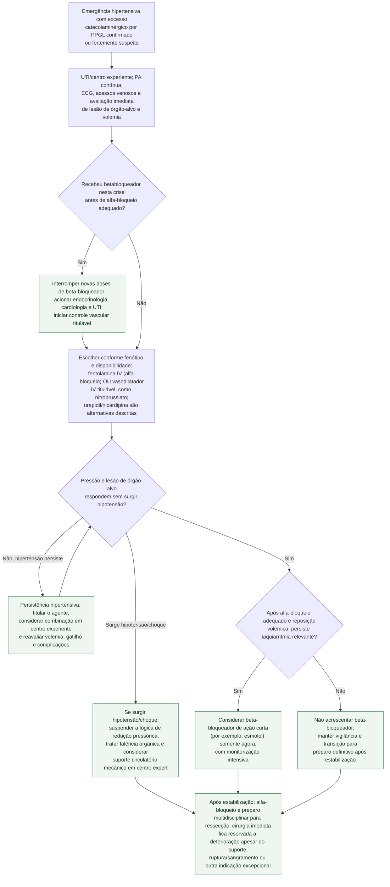

# Crise hipertensiva adrenérgica do feocromocitoma

Este fluxo começa quando a pressão muito elevada está acompanhada de **lesão
aguda de órgão-alvo** ou deterioração clínica atribuível ao excesso de
catecolaminas em feocromocitoma/paraganglioma (PPGL) confirmado ou fortemente
suspeito. Paroxismo de cefaleia, sudorese e palpitações aumenta a suspeita, mas
não basta para definir emergência hipertensiva.

O preparo pré-operatório eletivo é outra pergunta e está descrito no documento
específico do acervo. Na crise, a prioridade é estabilização em UTI/centro com
experiência, porque hipertensão grave pode alternar rapidamente com hipotensão,
edema pulmonar, arritmia, cardiomiopatia e choque.

## Árvore de decisão

## O que a fonte sustenta — e o que ela não sustenta

O posicionamento do Conselho de Hipertensão da ESC descreve **fentolamina**,
**nitroprussiato** e **urapidil** como fármacos usados no manejo do
feocromocitoma e considera **nicardipina** uma alternativa. Esses agentes não
são equivalentes: fentolamina é alfa-bloqueador competitivo; nitroprussiato,
urapidil e nicardipina reduzem pressão por outros mecanismos. A escolha e a
combinação dependem de pressão, volemia, função ventricular, lesão de órgão-alvo
e disponibilidade local.

O mesmo documento registra aceleração paradoxal da hipertensão com
**labetalol** em casos de feocromocitoma. A atualização de Whitelaw et al.
explica a sequência: beta-bloqueio remove a vasodilatação beta-2 e deixa a
vasoconstrição alfa sem oposição. Se houver taquiarritmia relevante, um agente
curto como esmolol só entra **depois** de alfa-bloqueio e ressuscitação volêmica
adequados.

## Por que este fluxo não contém doses

O artigo da ESC recebeu corrigendum por múltiplos erros de posologia em sua
Tabela 4. Além disso, a evidência específica de crise por PPGL é composta
principalmente por séries e relatos, e a disponibilidade das formulações varia.
Por segurança, este documento oferece a **sequência decisória**, mas não
substitui prescrição do protocolo institucional, farmácia clínica e equipe
intensiva. Dose, concentração, velocidade de titulação, contraindicações e
monitorização devem ser conferidas no ponto de cuidado.

## Cirurgia: estabilizar primeiro, sem transformar isso em absoluto

Na revisão de 97 casos de Scholten et al., cirurgia de emergência se associou a
mais complicações intraoperatórias (80% versus 42%), pós-operatórias (71% versus
33%) e maior mortalidade (18% versus 0%) que cirurgia urgente/eletiva após
estabilização. Por isso, a regra é estabilizar e estabelecer bloqueio adequado
antes da ressecção. Ainda assim, deterioração progressiva apesar de suporte,
ruptura tumoral ou sangramento podem exigir decisão cirúrgica excepcional e
multidisciplinar; “nunca operar na crise” seria uma simplificação perigosa.

## Tudo com Tudo

- [Feocromocitoma: preparo pré-operatório e ensaio PRESCRIPT](feocromocitoma-preparo-pre-operatorio-com-bloqueio-alfa-o-ensaio-prescript.md)
- [Aldosteronismo primário e feocromocitoma: testes confirmatórios](aldosteronismo-primario-e-feocromocitoma-testes-confirmatorios-endocrine-society.md)
- [Fluxograma geral de emergência hipertensiva](fluxograma-emergencia-hipertensiva.md)
- [Miocardiopatia catecolaminérgica por feocromocitoma/paraganglioma](../Geral/miocardiopatia-catecolaminergica-por-feocromocitoma-e-paraganglioma-suspeitar-antes-de-atribuir-a-estresse.md)
- [Takotsubo basal/invertido e gatilho catecolaminérgico](../Saúde_mental_e_cardiologia/takotsubo-variante-basal-invertida-reconhecimento-do-padrao-atipico-e-gatilho-catecolaminergico.md)
