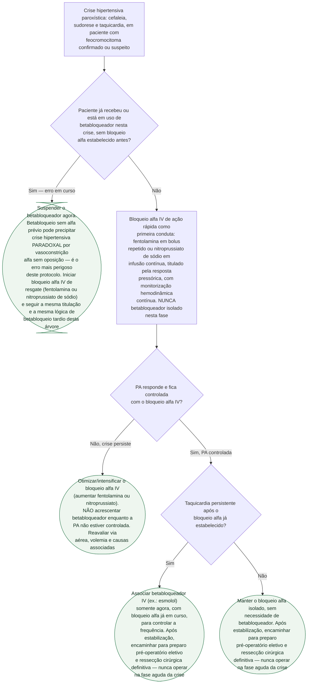

# Crise hipertensiva adrenérgica do feocromocitoma

O documento `feocromocitoma-preparo-pre-operatorio-com-bloqueio-alfa-o-ensaio-prescript.md`, nesta mesma pasta, trata do preparo pré-operatório **eletivo** — bloqueio alfa oral por 2 a 3 semanas antes de uma cirurgia programada. Este fluxograma cobre a situação diferente: o paciente **já está em crise**, com liberação maciça e súbita de catecolaminas — paroxismo de cefaleia, sudorese e taquicardia, com pressão arterial muito elevada — e a conduta precisa de bloqueio alfa **por via intravenosa e de ação rápida**, não pelo esquema de titulação oral de semanas.

## Árvore de decisão

## Por que o ramo do betabloqueador isolado é o erro mais perigoso

Bloquear o receptor beta sem bloqueio alfa prévio deixa a vasoconstrição alfa-adrenérgica **sem oposição**: a queda da vasodilatação mediada por beta-2 some, o efeito cronotrópico negativo reduz o débito cardíaco compensatório, e a resistência vascular periférica sobe ainda mais — o resultado é agravamento paradoxal da crise hipertensiva, não controle dela. É por isso que a árvore trata esse cenário como um ramo próprio de correção de erro (nó `C1`), e não como uma variação menor do fluxo principal: se o betabloqueador já foi dado sem bloqueio alfa estabelecido, a primeira ação é suspendê-lo, não apenas "adicionar" o bloqueio alfa por cima.

## Doses de referência, e o que exige verificação institucional

- **Fentolamina IV**: bloqueador alfa não seletivo de ação curta (10 a 15 minutos), usado em bolus repetido conforme resposta pressórica. A faixa mais citada na literatura é de 1 a 5 mg por bolus, podendo ser repetida a cada poucos minutos. `VERIFICAÇÃO HUMANA NECESSÁRIA` para o protocolo exato de dose/intervalo do serviço, pela variação entre fontes.
- **Nitroprussiato de sódio IV**: infusão contínua, titulada minuto a minuto pela resposta pressórica, exige monitorização de PA idealmente invasiva pelo risco de hipotensão abrupta. `VERIFICAÇÃO HUMANA NECESSÁRIA` para a faixa de mcg/kg/min do protocolo do serviço.
- **Nicardipina e urapidil** aparecem como alternativas de bloqueio agudo na literatura de hipertensão, mas sem posologia detalhada nas fontes consultadas para este documento — `VERIFICAÇÃO HUMANA NECESSÁRIA` antes de usar como primeira escolha.
- **Betabloqueador (ex.: esmolol)**, quando indicado pela taquicardia persistente com bloqueio alfa já estabelecido: dose a confirmar no protocolo do serviço — `VERIFICAÇÃO HUMANA NECESSÁRIA`.

## O que se repete em todo ramo, e por isso não está na árvore

**Monitorização contínua** de pressão arterial (idealmente invasiva) e ECG, com acesso venoso calibroso, do primeiro minuto até a estabilização — vale para qualquer ramo do fluxograma.

**Reavaliação frequente**, a cada poucos minutos durante a titulação IV: tanto o bloqueio alfa quanto o eventual betabloqueador são ajustados pela resposta hemodinâmica, não por uma dose fixa única.

**Buscar fator desencadeante identificável** — manipulação ou palpação do tumor, alguns antieméticos (ex.: metoclopramida), contraste iodado, corticoide em dose alta — e afastá-lo quando possível, em paralelo ao tratamento farmacológico.

**A ressecção cirúrgica definitiva nunca é conduta da fase aguda.** Depois de estabilizada a crise, o caminho é o preparo pré-operatório eletivo descrito no documento `feocromocitoma-preparo-pre-operatorio-com-bloqueio-alfa-o-ensaio-prescript.md` — bloqueio alfa oral (fenoxibenzamina ou doxazosina) por 2 a 3 semanas, dieta hipersódica, expansão volêmica e, se necessário, betabloqueador oral somente depois do bloqueio alfa em curso — e não uma cirurgia de urgência guiada pela crise que acabou de ser controlada.
