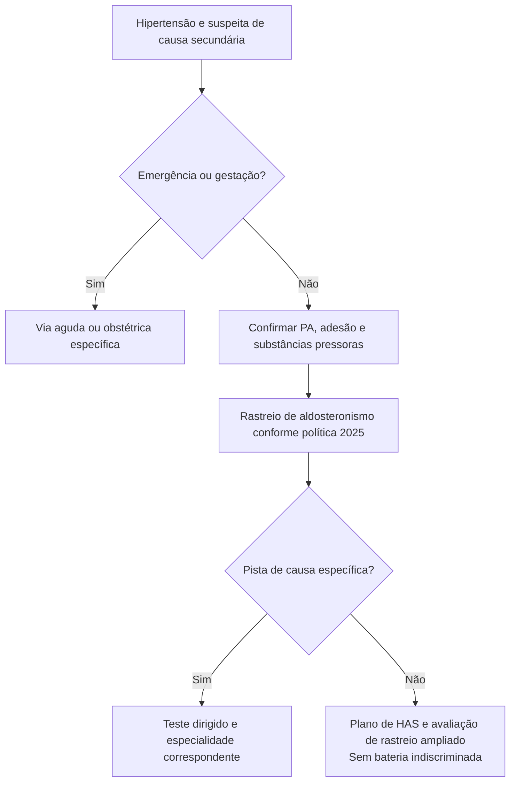

# Fluxograma: destino ambulatorial na suspeita de hipertensão secundária

## Aplicação

Aplicar os critérios do protocolo irmão antes de escolher o ramo. Estabilidade atual, evolução e acesso determinam o prazo; o fluxograma não estabelece doses nem substitui o algoritmo específico.

## Navegação

- [`suspeita-ambulatorial-de-hipertensao-secundaria-quando-escalar-investigacao`](/biblioteca/suspeita-ambulatorial-de-hipertensao-secundaria-quando-escalar-investigacao)
- [`destino-da-investigacao-de-secundaria-centro-has-endocrino-nefrologia`](/biblioteca/destino-da-investigacao-de-secundaria-centro-has-endocrino-nefrologia)
- [`fluxograma-investigacao-hipertensao-secundaria-quando-suspeitar`](/biblioteca/fluxograma-investigacao-hipertensao-secundaria-quando-suspeitar)
