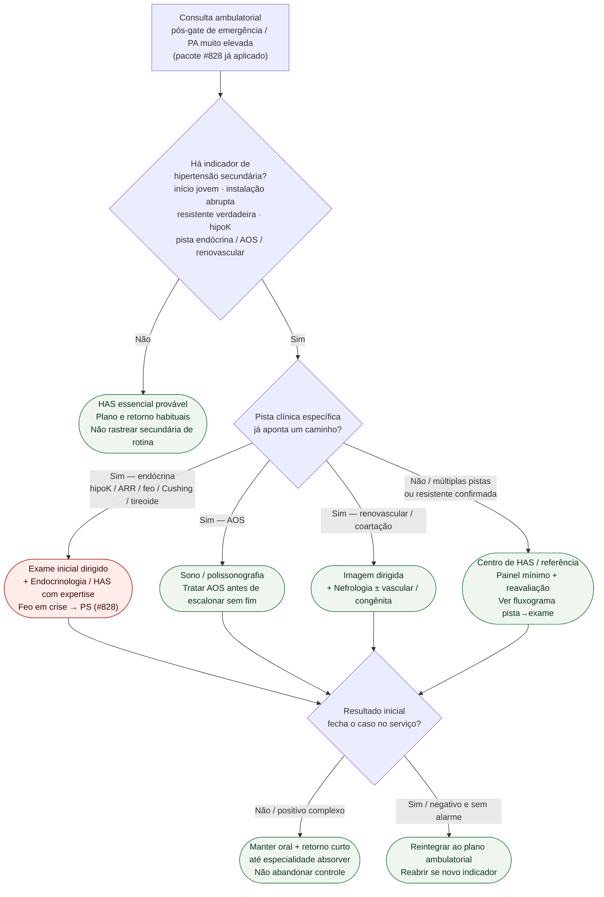

# Fluxograma: destino ambulatorial na suspeita de hipertensão secundária

Prosa: [`suspeita-ambulatorial-de-hipertensao-secundaria-quando-escalar-investigacao`](suspeita-ambulatorial-de-hipertensao-secundaria-quando-escalar-investigacao.md) · [`destino-da-investigacao-de-secundaria-centro-has-endocrino-nefrologia`](destino-da-investigacao-de-secundaria-centro-has-endocrino-nefrologia.md).

Gate prévio (PS vs retorno precoce): [#828](https://github.com/rafaelpaesmeirelles/MeuCardio/pull/828) / [`fluxograma-sinais-de-alarme-ambulatoriais-hipertensao`](fluxograma-sinais-de-alarme-ambulatoriais-hipertensao.md). Pista→exame: [`fluxograma-investigacao-hipertensao-secundaria-quando-suspeitar`](fluxograma-investigacao-hipertensao-secundaria-quando-suspeitar.md).

## Árvore de decisão

## Notas

- **D1** = gate de secundária (não é o gate de lesão aguda do #828).
- **D2** = escolhe **destino**, não o corte laboratorial confirmatório.
- **Não decide** metas IV, doses, quarta droga nem painel “tudo junto”.
