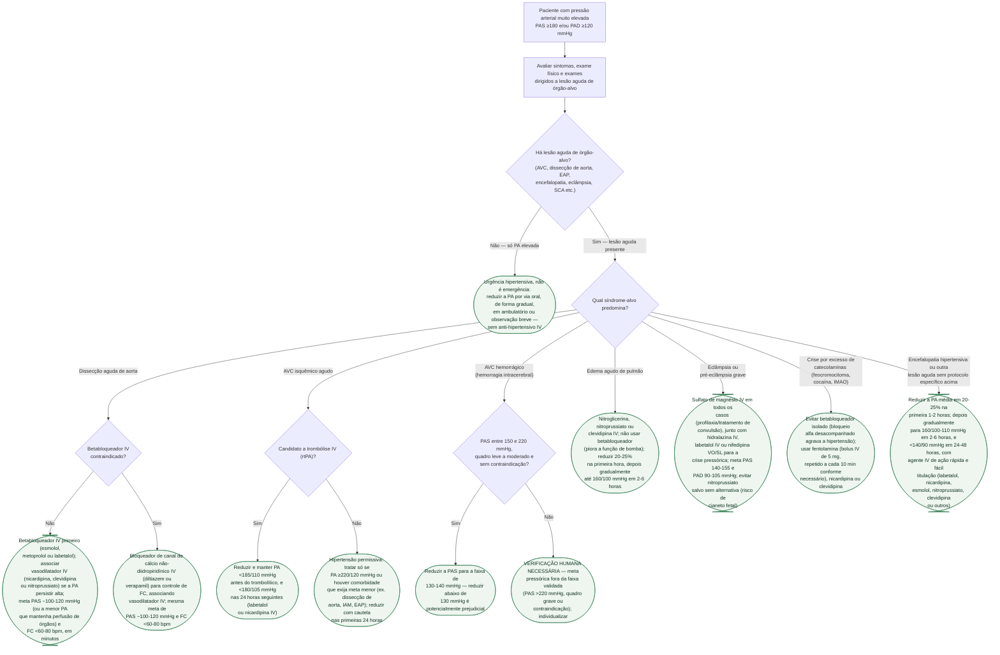

# Fluxograma: Emergência hipertensiva

Emergência e urgência hipertensiva não se distinguem pelo valor da pressão, e
sim pela presença de **lesão aguda de órgão-alvo**. Uma vez confirmada a
emergência, a escolha do anti-hipertensivo IV e a velocidade de redução da PA
mudam conforme a síndrome — a dissecção de aorta exige queda rápida e
agressiva de PA e FC, enquanto o AVC isquêmico tolera pressão bem mais alta
por mais tempo. Este documento complementa o protocolo geral de emergência
hipertensiva já publicado nesta biblioteca, detalhando essa bifurcação inicial
e o recorte por síndrome-alvo.

## Árvore de decisão

## O que vale para todo ramo de emergência, e por isso não está na árvore

**Ambiente monitorado**, com aferição frequente da PA — idealmente por
cateter arterial invasivo quando a infusão IV é titulada continuamente — e
reavaliação constante da dose. A característica que une os agentes eficazes
não é a droga específica, e sim ação rápida e fácil titulação.

**Fora da dissecção de aorta, não é necessário — nem desejável — normalizar a
pressão com urgência.** Reduções mais agressivas do que a meta de cada
síndrome arriscam hipoperfusão, sobretudo em quem tem hipertensão crônica e a
autorregulação de órgão deslocada para pressões mais altas.

**Investigar e tratar a causa desencadeante em paralelo**, quando houver uma:
suspender estimulante simpaticomimético na crise por catecolaminas, tratar a
convulsão associada na eclâmpsia, buscar a etiologia da lesão de órgão-alvo
antes de dar alta da fase aguda.

## Metas e fármacos por síndrome, em resumo

| Síndrome-alvo | Meta de PA/FC | Fármaco(s) de escolha | Evitar |
|---|---|---|---|
| Dissecção aguda de aorta | PAS ~100-120 mmHg e FC <60-80 bpm, em minutos | Betabloqueador IV primeiro; vasodilatador IV associado | Vasodilatador isolado antes do controle de FC (taquicardia reflexa propaga a dissecção) |
| AVC isquêmico, candidato a trombólise | PA <185/110 mmHg antes do rtPA; <180/105 mmHg nas 24h seguintes | Labetalol ou nicardipina IV | — |
| AVC isquêmico, sem trombólise | Permissiva até 220/120 mmHg nas primeiras 24h | Tratar só acima do limiar, ou se houver comorbidade que exija menos | Redução agressiva precoce |
| AVC hemorrágico, PAS 150-220 mmHg, leve-moderado | PAS 130-140 mmHg | — | Reduzir <130 mmHg (potencialmente prejudicial) |
| Edema agudo de pulmão | 20-25% na 1ª hora; depois 160/100 mmHg em 2-6h | Nitroglicerina, nitroprussiato ou clevidipina IV | Betabloqueador (piora a função de bomba) |
| Eclâmpsia / pré-eclâmpsia grave | PAS 140-155 mmHg, PAD 90-105 mmHg | Hidralazina IV, labetalol IV ou nifedipina VO/SL; sulfato de magnésio para convulsão | Nitroprussiato, salvo sem alternativa (risco de cianeto fetal) |
| Crise por catecolaminas | — | Fentolamina (bolus 5 mg IV a cada 10 min), nicardipina ou clevidipina | Betabloqueador isolado (bloqueio alfa desacompanhado) |
