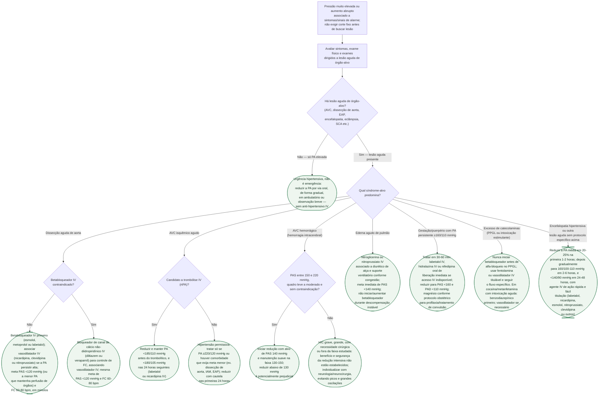

# Fluxograma: Emergência hipertensiva

Emergência e urgência hipertensiva não se distinguem pelo valor da pressão, e
sim pela presença de **lesão aguda de órgão-alvo**. Uma vez confirmada a
emergência, a escolha do anti-hipertensivo IV e a velocidade de redução da PA
mudam conforme a síndrome — a dissecção de aorta exige queda rápida e
agressiva de PA e FC, enquanto o AVC isquêmico tolera pressão bem mais alta
por mais tempo. Este documento complementa o protocolo geral de emergência
hipertensiva já publicado nesta biblioteca, detalhando essa bifurcação inicial
e o recorte por síndrome-alvo.

## Árvore de decisão

## O que vale para todo ramo de emergência, e por isso não está na árvore

**Ambiente monitorado**, com aferição frequente da PA — idealmente por
cateter arterial invasivo quando a infusão IV é titulada continuamente — e
reavaliação constante da dose. A característica que une os agentes eficazes
não é a droga específica, e sim ação rápida e fácil titulação.

**Fora da dissecção de aorta, não é necessário — nem desejável — normalizar a
pressão com urgência.** Reduções mais agressivas do que a meta de cada
síndrome arriscam hipoperfusão, sobretudo em quem tem hipertensão crônica e a
autorregulação de órgão deslocada para pressões mais altas.

**Investigar e tratar a causa desencadeante em paralelo**, quando houver uma:
suspender estimulante simpaticomimético na crise por catecolaminas, tratar a
convulsão associada na eclâmpsia, buscar a etiologia da lesão de órgão-alvo
antes de dar alta da fase aguda.

## Metas e fármacos por síndrome, em resumo

| Síndrome-alvo | Meta de PA/FC | Fármaco(s) de escolha | Evitar |
|---|---|---|---|
| Dissecção aguda de aorta | PAS <120 mmHg ou menor valor que preserve perfusão; FC 60-80 bpm | Betabloqueador IV primeiro; vasodilatador IV associado | Vasodilatador isolado antes do controle de FC (taquicardia reflexa propaga a dissecção) |
| AVC isquêmico, candidato a trombólise | PA <185/110 mmHg antes do rtPA; <180/105 mmHg nas 24h seguintes | Labetalol ou nicardipina IV | — |
| AVC isquêmico, sem trombólise | Permissiva até 220/120 mmHg nas primeiras 24h | Tratar só acima do limiar, ou se houver comorbidade que exija menos | Redução agressiva precoce |
| Hemorragia intracerebral, PAS 150-220 mmHg, leve-moderada | Alvo 140 mmHg; manter 130-150 mmHg | Agente IV titulável, com controle suave e sustentado | Reduzir <130 mmHg; aplicar esse alvo automaticamente à HIC grave |
| Edema agudo de pulmão hipertensivo | PAS <140 mmHg, com reavaliação imediata de perfusão | Nitroglicerina ou nitroprussiato IV, diurético de alça e suporte ventilatório conforme fenótipo | Iniciar ou aumentar betabloqueador na descompensação instável |
| Gestação/puerpério com PA persistente ≥160/110 mmHg | PAS <160 e PAD <110 mmHg em 30-60 min | Hidralazina IV, labetalol IV ou nifedipina oral de liberação imediata; magnésio conforme indicação obstétrica | Nifedipina sublingual |
| Crise por PPGL | Individualizada por órgão-alvo e transição possível para choque | Fentolamina ou vasodilatador IV titulável; ver fluxo dedicado | Betabloqueador antes de alfa-bloqueio |
| Intoxicação aguda por cocaína/metanfetamina | Individualizada por órgão-alvo | Benzodiazepínico primeiro; associar vasodilatador se necessário | Betabloqueador quando há sinais de intoxicação aguda sem vasodilatador coronariano |

## Limites

- O número da pressão não define sozinho uma emergência. Dissecção aórtica,
  eclâmpsia e outras lesões agudas podem exigir tratamento abaixo de 180/120
  mmHg; já pressão acima desse valor sem lesão aguda não autoriza queda IV
  rápida.
- A meta de hemorragia intracerebral vale para apresentação **leve a moderada**
  com PAS inicial entre 150 e 220 mmHg. Na HIC grave, grande, cirúrgica ou com
  PAS fora dessa faixa, a diretriz não estabelece benefício da mesma estratégia
  intensiva; priorizam-se controle suave, perfusão e decisão neurocrítica.
- “Catecolaminas” não é um protocolo único. PPGL e intoxicação estimulante
  compartilham riscos, mas diferem no tratamento inicial; por isso aparecem em
  linhas e fluxos separados.

## Tudo com Tudo

- [Emergência hipertensiva e triagem de hipertensão secundária](emergencia-hipertensiva-e-triagem-de-hipertensao-secundaria.md)
- [Crise hipertensiva por feocromocitoma/paraganglioma](fluxograma-crise-hipertensiva-adrenergica-do-feocromocitoma.md)
- [Diretriz ACC/AHA 2025 de hipertensão no adulto](acc-aha-2025-diretriz-hipertensao-arterial-adultos.md)
- [Nitroprussiato: limites e toxicidade](nitroprussiato-na-emergencia-hipertensiva-tetos-e-toxicidade-pela-bula-brasileira.md)
- [Fluxograma de dor torácica e SCA por cocaína](../Saúde_mental_e_cardiologia/fluxograma-dor-toracica-aguda-com-uso-recente-confirmado-ou-suspeito-de-cocaina.md)
