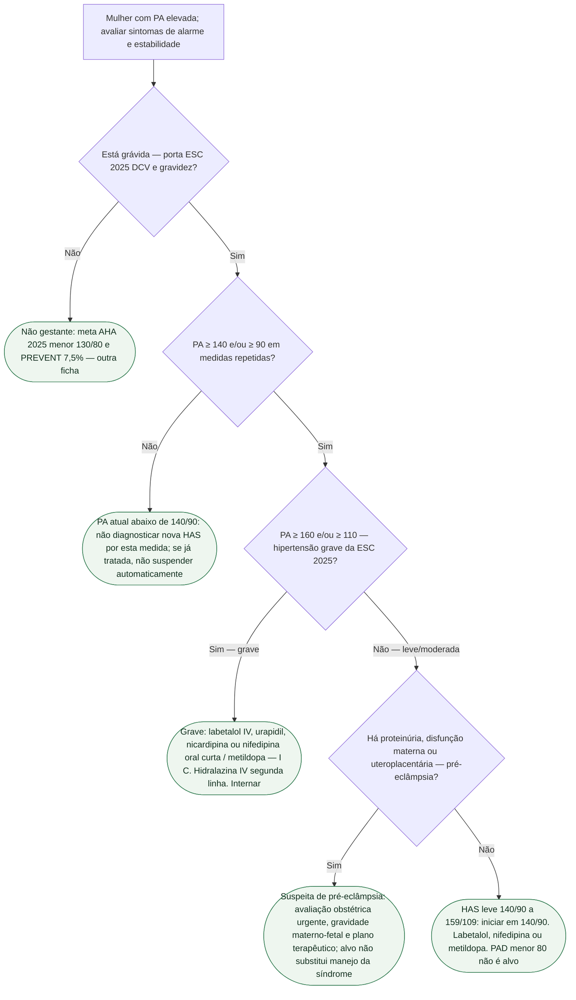

# Fluxograma: HAS na gestante — não é PREVENT

ESC 2025 gravidez: visar **< 140/90** (I B). HAS = ≥ 140 e/ou ≥ 90. AHA 2025 <130/80 e PREVENT 7,5% **não** reescrevem o pré-natal. Nós finais duplicados.

## Árvore de decisão

## Tudo com Tudo

- Hipertensão
- Gravidez
- Comunicação clínica
- Terapia intensiva
- Cardiologia geriátrica
Sintomas neurológicos, dor epigástrica, dispneia, convulsão ou deterioração materno-fetal exigem avaliação imediata, mesmo sem PA grave documentada. Hipertensão prévia controlada continua sendo diagnóstico; proteinúria não é obrigatória para pré-eclâmpsia com disfunção de órgão-alvo.
