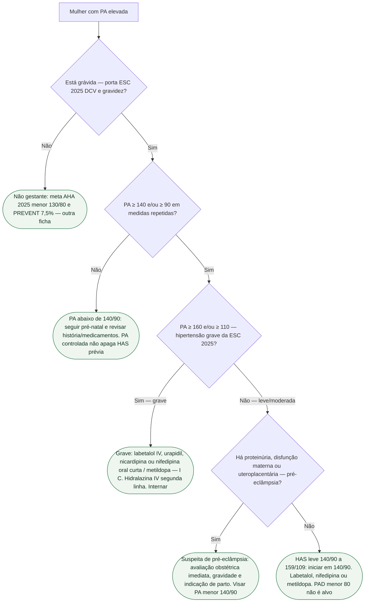

# Fluxograma: HAS na gestante — não é PREVENT

ESC 2025 gravidez: visar **< 140/90** (I B). HAS = ≥ 140 e/ou ≥ 90. AHA 2025 <130/80 e PREVENT 7,5% **não** reescrevem o pré-natal.

## Árvore de decisão

## Tudo com Tudo

- [Alvo 140/90 na gestante — não é a meta 130/80](/biblioteca/alvo-140-90-na-gestante-nao-e-a-meta-130-80)
- [Alvo pressórico na gestação: ESC 2025 (<140/90) e o recorte da AHA/ACC 2025](/biblioteca/alvo-pressorio-na-gestacao-esc-2025-e-aha-2025)
- [ESC 2025: doença cardiovascular e gravidez — Pregnancy Heart Team e mWHO 2.0](/biblioteca/esc-2025-doenca-cardiovascular-e-gravidez-equipe-e-mwho-20)
- [ESC 2025: insuficiência cardíaca aguda e choque na gestação](/biblioteca/esc-2025-ic-aguda-e-choque-na-gestacao)
