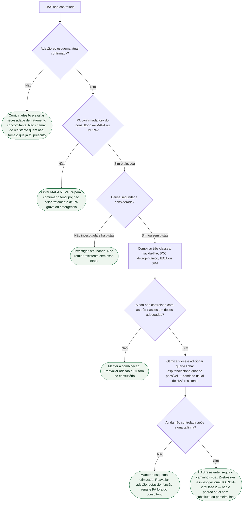

# Fluxograma: HAS não controlada — o que o KARDIA-2 não substitui

Árvore do **caminho usual** da hipertensão não controlada. KARDIA-2 (fase 2) mostrou que uma dose única subcutânea de zilebesiran 600 mg, em add-on a indapamida, anlodipino ou olmesartana, reduziu a PAS média ambulatorial de 24 horas aos 3 meses versus placebo (−12,1 mm Hg na indapamida; −9,7 mm Hg no anlodipino; −4,5 mm Hg na olmesartana). **Não é ensaio de desfecho cardiovascular.** Zilebesiran **não é padrão atual**, não substitui primeira linha e não entra como atalho para pular adesão, MAPA/MRPA, secundária, tríade ou quarta linha.

O programa permanece investigacional e já avançou ao ZENITH, ensaio de desfechos cardiovasculares de fase 3. KARDIA-1/2 são os ensaios de fase 2 resumidos aqui; as doses estudadas não equivalem a prescrição aprovada. [Desenvolvimento clínico](https://www.alnylam.com/alnylam-rnai-pipeline).

Nós verdes (estádio) são condutas. Losangos são decisões. Cada nó tem um único pai: o texto se repete em vez de fechar um ciclo.

Esta árvore é ambulatorial: suspeita de emergência hipertensiva ou lesão aguda de órgão exige avaliação imediata. Potássio, TFGe e contraindicações devem ser avaliados antes de ARM; investigar aldosteronismo na resistência, mesmo sem hipocalemia.

## Árvore de decisão

## Como ler a árvore

O primeiro ramal é **adesão**, não fármaco novo. KARDIA-2 randomizou quem já estava em run-in de um anti-hipertensivo de primeira linha. Saltar a confirmação de que o paciente toma o esquema atual para “ir ao siRNA” não é o que o ensaio autoriza.

O segundo ramal é **medida fora do consultório**. HAS não controlada no consultório isolado pode ser efeito do avental branco. Intensificar classe sem MAPA ou MRPA mistura fenótipos.

O terceiro ramal é **causa secundária**. Aldosteronismo primário, estenose de artéria renal, apneia do sono e coarctação não se resolvem com RNA de interferência. A árvore não lista o protocolo completo de secundária — só impede o rótulo de resistente sem essa pergunta.

O quarto ramal é a **tríade** (tiazida-like, BCC diidropiridínico, IECA ou BRA). Essa combinação é o padrão de não controlada; KARDIA-2 testou zilebesiran **sobre uma** dessas classes, não no lugar das três.

O quinto ramal é a **quarta linha usual** da HAS resistente — espironolactona quando possível, com vigilância de potássio e função renal. Não inventar classe de recomendação neste texto. Outras opções de quarta linha seguem a diretriz local vigente, não este fluxograma.

O último estádio deixa zilebesiran **fora** do padrão: fase 2, surrogato pressórico, add-on investigacional. A hipótese de adesão (injeção trimestral ou semestral versus comprimido diário) **não** é desfecho do ensaio.

## O que a árvore não mostra

- Dose prescritível de zilebesiran — 600 mg SC é a do KARDIA-2; não há, aqui, esquema de manutenção.
- Escolha entre indapamida, clortalidona e hidroclorotiazida, ou entre IECA e BRA.
- Protocolo completo de hipertensão secundária.
- Comparação com denervação renal.
- Desfecho de infarto, AVC ou morte — KARDIA-2 e KARDIA-1 não medem isso.

## Tudo com Tudo

- [Fluxograma: HAS resistente após otimização — o que vem depois](/biblioteca/fluxograma-has-resistente-apos-otimizacao-o-que-vem-depois)
- [Fluxograma: iniciar fármaco na HAS — AHA/ACC 2025 e PREVENT ≥7,5%](/biblioteca/fluxograma-inicio-de-farmaco-aha-2025-prevent)
- [KARDIA-2: zilebesiran (RNA de interferência) na HAS não controlada](/biblioteca/zilebesiran-kardia-2-rna-interferencia-na-has-nao-controlada)
- [Zilebesiran (KARDIA-1 e KARDIA-2): siRNA contra o angiotensinogênio — surrogato pressórico](/biblioteca/zilebesiran-kardia-sirna-angiotensinogenio)
