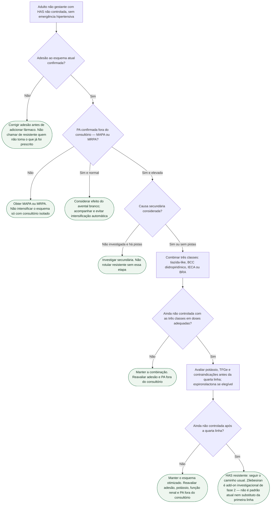

# Fluxograma: HAS não controlada — o que o KARDIA-2 não substitui

Árvore do **caminho usual** da hipertensão não controlada. KARDIA-2 (fase 2) mostrou que uma dose única subcutânea de zilebesiran 600 mg, em add-on a indapamida, anlodipino ou olmesartana, reduziu a PAS média ambulatorial de 24 horas aos 3 meses versus placebo (−12,1 mm Hg na indapamida; −9,7 mm Hg no anlodipino; −4,5 mm Hg na olmesartana). **Não é ensaio de desfecho cardiovascular.** Zilebesiran **não é padrão atual**, não substitui primeira linha e não entra como atalho para pular adesão, MAPA/MRPA, secundária, tríade ou quarta linha.

Status regulatório brasileiro do zilebesiran: **VERIFICAÇÃO HUMANA NECESSÁRIA.** A dose de 600 mg SC é a do ensaio, não receita.

Nós verdes (estádio) são condutas. Losangos são decisões. Cada nó tem um único pai: o texto se repete em vez de fechar um ciclo.

## Árvore de decisão

Suspeita de lesão aguda de órgão-alvo exige avaliação urgente; não aguardar MAPA, adesão ou investigação eletiva para tratar uma emergência.

## Como ler a árvore

O primeiro ramal é **adesão**, não fármaco novo. KARDIA-2 randomizou quem já estava em run-in de um anti-hipertensivo de primeira linha. Saltar a confirmação de que o paciente toma o esquema atual para “ir ao siRNA” não é o que o ensaio autoriza.

O segundo ramal é **medida fora do consultório**. HAS não controlada no consultório isolado pode ser efeito do avental branco. Intensificar classe sem MAPA ou MRPA mistura fenótipos.

O terceiro ramal é **causa secundária**. Aldosteronismo primário, estenose de artéria renal, apneia do sono e coarctação não se resolvem com RNA de interferência. A árvore não lista o protocolo completo de secundária — só impede o rótulo de resistente sem essa pergunta.

O quarto ramal é a **tríade** (tiazida-like, BCC diidropiridínico, IECA ou BRA). Essa combinação é o padrão de não controlada; KARDIA-2 testou zilebesiran **sobre uma** dessas classes, não no lugar das três.

O quinto ramal é a **quarta linha usual** da HAS resistente — espironolactona quando possível, com vigilância de potássio e função renal. Não inventar classe de recomendação neste texto. Outras opções de quarta linha seguem a diretriz local vigente, não este fluxograma.

O último estádio deixa zilebesiran **fora** do padrão: fase 2, surrogato pressórico, add-on investigacional. A hipótese de adesão (injeção trimestral ou semestral versus comprimido diário) **não** é desfecho do ensaio.

## O que a árvore não mostra

- Dose prescritível de zilebesiran — 600 mg SC é a do KARDIA-2; não há, aqui, esquema de manutenção.
- Escolha entre indapamida, clortalidona e hidroclorotiazida, ou entre IECA e BRA.
- Protocolo completo de hipertensão secundária.
- Comparação com denervação renal.
- Desfecho de infarto, AVC ou morte — KARDIA-2 e KARDIA-1 não demonstram redução desses eventos.

## Tudo com Tudo

- **Hipertensão:** esta árvore é o caminho da não controlada e da resistente; zilebesiran não abre um atalho.
- **Farmacologia:** o siRNA anti-angiotensinogênio permanece investigacional; ver o documento de o que é e o que ainda não é.
- **Cardiorrenal:** quarta linha com espironolactona exige potássio e função renal; o braço zilebesiran do KARDIA-2 teve mais hipercalemia e lesão renal aguda que o placebo.
- **Prevenção e lipídios:** controlar a PA reduz risco; o ensaio não prova que o siRNA reduz eventos.
- **Comunicação clínica:** “ainda não é tratamento padrão; o próximo passo é conferir se a medicação está sendo tomada e se a pressão fora do consultório confirma o descontrole.”

## Atualização KARDIA-3

Atualização do programa: no KARDIA-3, apresentado no ESC 2025, o critério de significância do desfecho primário não foi atingido após controle de multiplicidade. A redução nominal de PAS com 300 mg não torna o ensaio positivo. Fonte: comunicado Roche/Alnylam de 30/08/2025; dados de congresso, sem comprovação de redução de eventos cardiovasculares.
