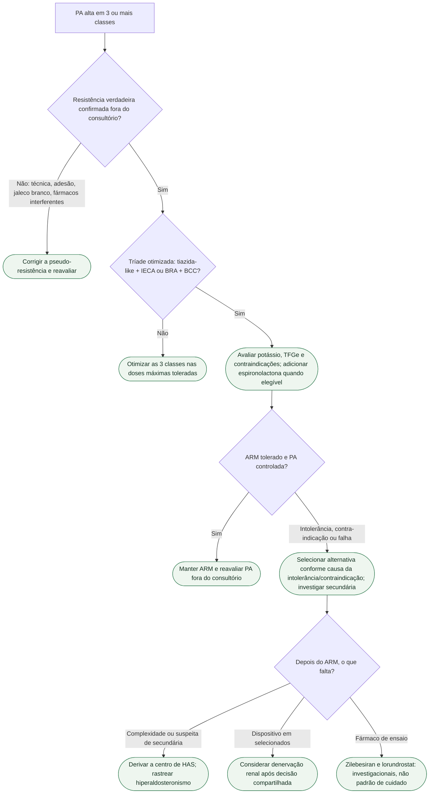

# Fluxograma: HAS resistente após otimização — o que vem depois

Árvore qualitativa para o adulto com **pressão aparentemente não controlada em três classes**. A lógica segue as diretrizes ESC 2024 e AHA/ACC 2025: confirmar resistência verdadeira, excluir pseudo-resistência, otimizar a tríade (tiazida-like + IECA ou BRA + bloqueador de cálcio) e, então, adicionar antagonista do receptor mineralocorticoide — espironolactona como próximo passo usual. **Esta ficha não atribui Classe/COR aos nós.** Números de Classe saem das diretrizes, não desta árvore.

Zilebesiran e lorundrostat, se aparecerem no fim, estão **rotulados como investigacionais**. Não são padrão de cuidado.

## Árvore de decisão

## Como ler cada ramo

**Confirmar resistência verdadeira.** PA de consultório alta em três classes, nas doses máximas toleradas, **não basta**. Confirmar fora do consultório (MAPA ou MRPA). ESC 2024 define resistência quando diurético (tiazida ou tiazida-like) + bloqueador do SRA + bloqueador de cálcio falham em baixar a PA de consultório a <140/90 mmHg, com confirmação fora do consultório. AHA/ACC 2025 trabalha com a tríade IECA/BRA + BCC + tiazida-like (clortalidona ou indapamida). Com TFGe baixa, o diurético de alça entra na definição — detalhe de diretriz, não inventado aqui.

**Excluir pseudo-resistência.** Técnica (manguito, posição, repouso), adesão (incluindo combinação em pílula única quando possível), hipertensão do avental branco e fármacos interferentes (AINE, descongestionantes, simpaticomiméticos, glicocorticoide, eritropoetina, entre outros). Enquanto a pseudo-resistência não foi excluída, **não** se rotula o caso como resistente verdadeira e **não** se avança para o quarto fármaco por esse rótulo.

**Otimizar as três classes.** Tiazida-like (indapamida ou clortalidona, conforme a diretriz em uso) + IECA ou BRA + bloqueador de cálcio di-hidropiridínico, nas doses máximas toleradas. Hidroclorotiazida em dose baixa, sem tiazida-like, **não** fecha a tríade. Otimizar o diurético conforme função renal e tolerabilidade; não atrasar o manejo de PA grave enquanto se esclarece o fenótipo.

**Adicionar ARM.** Rastrear aldosteronismo primário antes de iniciar ARM quando possível, pois esses fármacos interferem no exame; não esperar falha de quatro drogas para investigar. Espironolactona é o próximo passo **usual** na resistência verdadeira. PATHWAY-2 (PMID **26414968**) mostrou superioridade da espironolactona 25–50 mg sobre placebo, doxazosina e bisoprolol na PAS domiciliar — ensaio de pressão, não de MACE. Potássio e TFGe limitam o uso; a AHA/ACC 2025 condiciona o ARM a TFGe ≥45 mL/min/1,73 m² no recorte de resistência. Se houver efeitos endócrinos da espironolactona, eplerenona pode ser alternativa. Hipercalemia e disfunção renal também limitam eplerenona; nesses casos selecionar outra estratégia — sem hierarquia numérica nesta árvore.

**Derivar, secundária, dispositivo.** Encaminhar a centro experiente. Rastrear hiperaldosteronismo primário mesmo sem hipocalemia (mensagem da AHA/ACC 2025). Denervação renal: opção em **selecionados**, após decisão compartilhada, em centro com volume, **não** atalho para quem ainda não otimizou tríade e ARM.

**Investigacionais.** Zilebesiran (KARDIA, PAS ambulatória, fase 2) e lorundrostat (Target-HTN, Launch-HTN, Advance-HTN — PAS, não MACE) **não** substituem o ARM aprovado. Se o paciente pergunta, o rótulo é ensaio.

Nós verdes (estádio) são condutas. Losangos são decisões. Cada nó tem um único pai: quando a mesma ideia reaparece, o texto se repete em vez de fechar um ciclo.

## Tudo com Tudo

- [Fluxograma: HAS não controlada — o que o KARDIA-2 não substitui](/biblioteca/fluxograma-has-nao-controlada-o-que-kardia-2-nao-substitui)
- [Lorundrostat (Target-HTN e Advance-HTN): inibidor da sintase da aldosterona — PAS, não MACE](/biblioteca/lorundrostat-target-htn-inibidor-aldosterona-sintase)
- [Lorundrostat (Target-HTN e Launch-HTN): inibidor da sintase da aldosterona — PAS, não MACE](/biblioteca/lorundrostat-target-htn-ou-launch-htn)
- [ESC 2026 STAMP e PREVENT: duas portas de rastreio que o clínico geral não pode perder](/biblioteca/esc-2026-stamp-e-prevent-duas-portas-de-rastreio-que-o-clinico-geral-nao-pode-perder)
