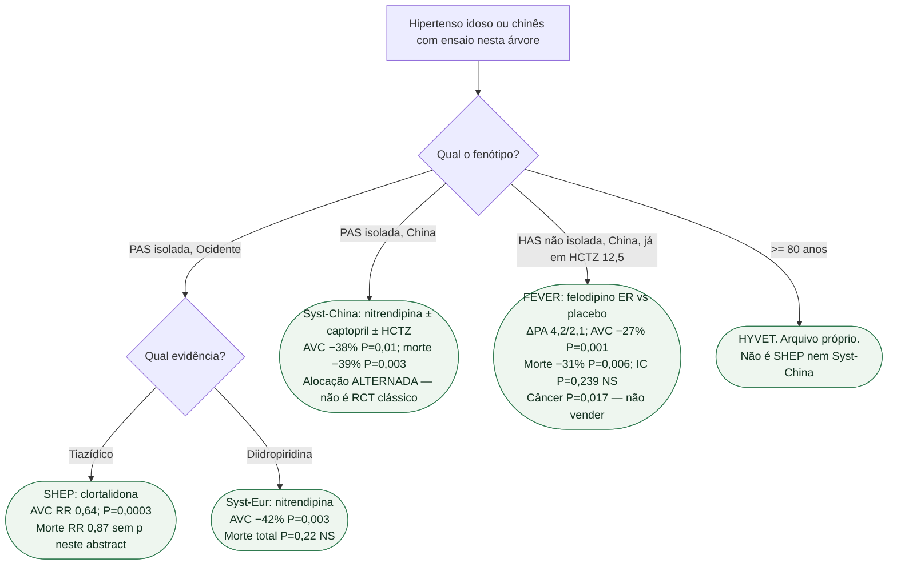

# Fluxograma: PAS isolada e o FEVER chinês

## Mensagem prática

**PAS isolada ocidental: SHEP e Syst-Eur reduzem AVC; morte total não está fechada.** Syst-China aponta na mesma direção com nitrendipina, mas a alocação foi **alternada** — não equiparar ao Syst-Eur. FEVER é outro fenótipo (felodipino no topo de HCTZ, ΔPA pequeno, IC NS). Não reescrever a árvore SHEP/Syst-Eur/HYVET.
