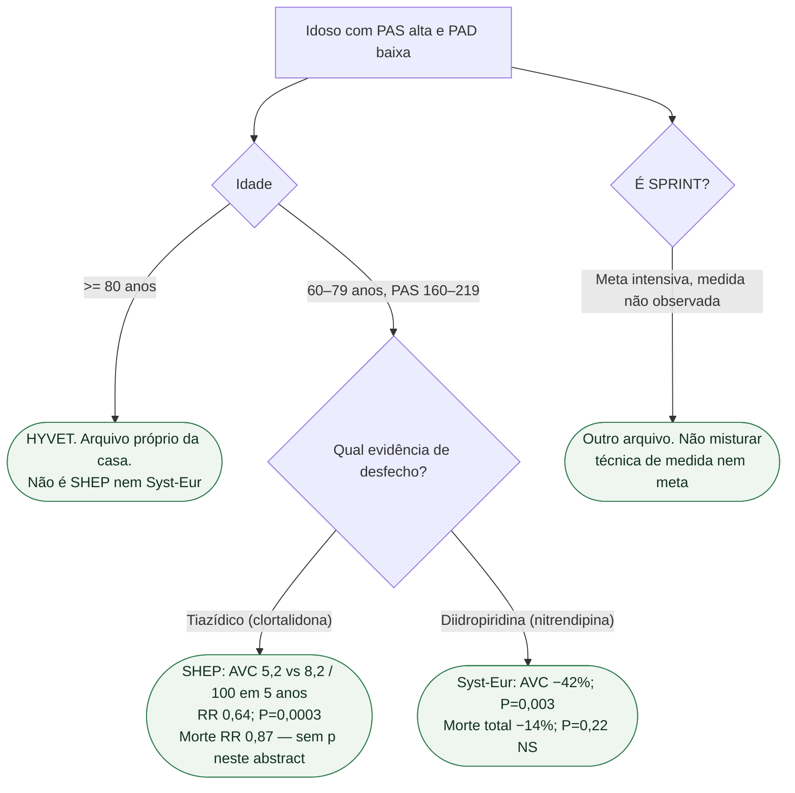

# Fluxograma: PAS isolada no idoso

## Mensagem prática

**Tratar a PAS isolada do idoso reduz AVC (SHEP, Syst-Eur). A morte total não está provada nestes abstracts.** HYVET cobre o ≥80. SPRINT não entra nesta árvore.
