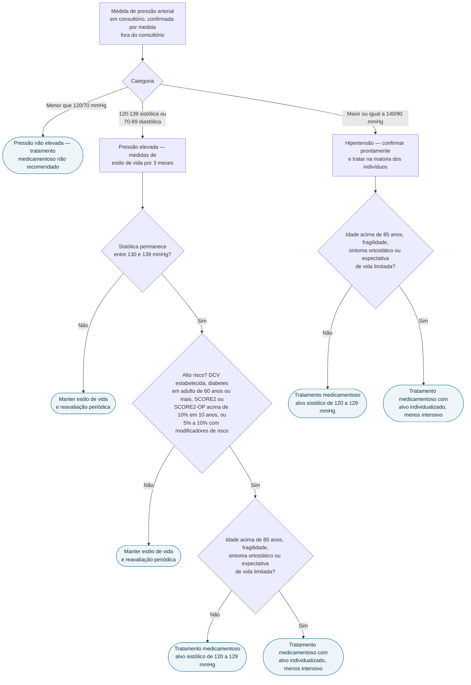

# Fluxograma: Pressão arterial elevada e hipertensão (ESC 2024)

A ESC 2024 fez duas mudanças que alteram a conduta diária. A primeira é
**uma terceira categoria de pressão arterial** — "pressão elevada", entre
120–139 mmHg de sistólica ou 70–89 mmHg de diastólica —, que existe para
identificar quem se beneficia de tratamento antes de cruzar o limiar
clássico de 140/90. A segunda é o **alvo sistólico de 120–129 mmHg** como
ponto de partida da maioria dos tratados, e não como meta opcional: o
documento inverteu a lógica anterior, em que a intensificação era a exceção.

## Árvore de decisão

## As três categorias

| Categoria | Definição em consultório | Conduta medicamentosa |
|---|---|---|
| Pressão não elevada | < 120/70 mmHg | Não recomendada |
| Pressão elevada | 120–139 mmHg sistólica **ou** 70–89 mmHg diastólica | Recomendada em indivíduos selecionados, conforme risco cardiovascular e pressão no seguimento |
| Hipertensão | ≥ 140/90 mmHg | Confirmação pronta e tratamento na maioria |

A categoria intermediária foi criada justamente para viabilizar alvos mais
intensivos em quem já tem risco cardiovascular aumentado — não para
transformar toda a faixa em doença tratável com fármaco.

## Quem trata na faixa de pressão elevada

A regra tem três degraus, e o tempo faz parte dela: **3 meses de medidas de
estilo de vida primeiro**. Se, depois desse período, a sistólica permanecer
entre 130 e 139 mmHg, o tratamento medicamentoso é recomendado quando houver:

- condição de alto risco — doença cardiovascular estabelecida, ou diabetes
  em adultos com 60 anos ou mais; **ou**
- risco cardiovascular estimado em 10 anos acima de 10% pelo **SCORE2**
  (40–69 anos) ou **SCORE2-OP** (70 anos ou mais); **ou**
- risco estimado entre 5% e 10% na presença de modificadores de risco.

Na prática, quem tem risco em 10 anos de 10% ou mais, ou comorbidade que já
o coloca em alto risco — diabetes, por exemplo —, começa terapia
anti-hipertensiva a partir de 130/80 mmHg.

## O alvo

O alvo sistólico para adultos em uso de medicação é de **120–129 mmHg**. A
diretriz prevê flexibilização explícita em quatro situações: idade acima de
85 anos, fragilidade, sintomas ortostáticos e expectativa de vida limitada.

A inversão de lógica é o ponto: o alvo intensivo é o primeiro passo do
manejo da maioria, e sai-se dele por circunstância definida ou por
intolerância do paciente — não se entra nele por exceção.

## Medida fora do consultório

A medida fora do consultório — monitorização ambulatorial ou residencial —
é recomendada para fins diagnósticos, porque é o que detecta hipertensão do
avental branco e hipertensão mascarada. As duas mudam a conduta em direções
opostas, e nenhuma das duas é identificável apenas com a medida de
consultório.

## Priorização

A abordagem baseada em risco significa priorizar ativamente os pacientes com
diabetes, doença renal, doença cardiovascular, lesão de órgão-alvo ou
hipercolesterolemia familiar — grupos em que a mesma cifra de pressão tem
consequência maior.
