# Fluxograma: Hipertensão no Paciente em Hemodiálise Crônica

A hipertensão acomete a maioria dos pacientes em hemodiálise crônica e costuma
estar mal controlada, mas o raciocínio clínico usado no ambulatório comum não
se aplica sem adaptação: a PA medida antes ou depois da sessão tem baixa
acurácia e associação em **U ou J** com mortalidade — não é boa base isolada
para diagnóstico —, o excesso de volume é o mecanismo predominante e precisa
ser corrigido antes de intensificar fármaco, e o próprio comportamento da PA
**durante** a sessão (hipertensão ou hipotensão intradialítica) é achado
clínico próprio, com definição operacional e prognóstico distintos da
hipertensão persistente entre as sessões. Este fluxograma resolve os três
pontos em sequência: como diagnosticar corretamente, como diferenciar
hipervolemia de hipertensão verdadeiramente resistente, e como reconhecer e
conduzir a alteração pressórica que ocorre dentro da própria sessão de
diálise.

## Árvore de decisão

```mermaid
flowchart TD
  R0["Paciente em hemodiálise crônica com pressão arterial<br/>alterada, achado a esclarecer"]
  R0 --> D1{"A alteração pressórica é persistente FORA da sessão<br/>(medida ambulatorial/domiciliar) ou varia de forma<br/>anormal DURANTE/logo após a sessão de diálise?"}

  D1 -->|"Persistente fora da sessão (padrão interdialítico)"| D2{"O diagnóstico foi baseado só em PA pré/pós-diálise<br/>isolada (peridialítica), sem MAPA ou MRPA interdialítico?"}

  D1 -->|"Varia de forma anormal durante ou logo após a sessão<br/>(padrão intradialítico)"| D5{"Durante ou após a sessão, a PA SOBE ou CAI<br/>de forma anormal?"}

  D2 -->|"Sim — só peridialítica, sem MAPA/MRPA"| C1(["Não firmar diagnóstico de hipertensão pela PA pré ou<br/>pós-diálise isolada — tem baixa acurácia e associação<br/>em U/J com mortalidade; solicitar MAPA interdialítico<br/>de 44h (padrão-ouro) ou, se indisponível, MRPA duas<br/>vezes ao dia por 1-2 semanas, ou duas vezes ao dia por<br/>4 dias após a sessão do meio da semana, antes de<br/>decidir qualquer conduta"])

  D2 -->|"Não — já tem MAPA/MRPA interdialítico<br/>confirmando PA elevada"| D3{"O peso seco (peso pós-diálise) está corretamente<br/>ajustado, sem sinais de hipervolemia?"}

  D3 -->|"Não — hipervolemia presente (ganho de peso<br/>interdialítico excessivo, edema, congestão)"| C2(["Reduzir gradualmente o peso seco por ajuste da<br/>ultrafiltração, associado a restrição de sódio e de<br/>líquidos; reavaliar o peso seco a cada sessão — o<br/>excesso de volume é o mecanismo predominante da<br/>hipertensão em diálise e deve ser corrigido antes de<br/>intensificar fármaco"])

  D3 -->|"Sim — peso seco já otimizado,<br/>PA interdialítica persiste elevada"| D4{"Já está em uso de anti-hipertensivo<br/>em dose otimizada?"}

  D4 -->|"Não — sem tratamento farmacológico ou em subdose"| D6{"O anti-hipertensivo a iniciar ou ajustar é removido<br/>de forma relevante pela hemodiálise (dialisável)?"}

  D4 -->|"Sim — já em anti-hipertensivo otimizado<br/>e ainda hipertenso"| C3(["Hipertensão resistente no paciente em diálise:<br/>reconfirmar adesão e a técnica de aferição fora da<br/>unidade, reavaliar o peso seco por método objetivo<br/>quando disponível (bioimpedância, ultrassom pulmonar),<br/>considerar associar espironolactona com monitorização<br/>rigorosa de potássio (evidência de benefício<br/>cardiovascular ainda mista entre os ensaios) e discutir<br/>com a equipe de nefrologia a intensificação da<br/>prescrição dialítica (maior tempo ou frequência de<br/>sessão)"])

  D6 -->|"Sim — dialisável"| C4(["Administrar a dose do anti-hipertensivo APÓS a sessão<br/>de hemodiálise, nunca antes, para evitar perda de<br/>efeito e hipotensão intradialítica somada à queda<br/>pressórica da própria ultrafiltração; IECA/BRA e<br/>bloqueador de canal de cálcio são considerados de<br/>primeira linha, com a escolha guiada pela comorbidade<br/>cardiovascular do paciente"])

  D6 -->|"Não — pouco ou não dialisável"| C5(["Manter o horário habitual da dose, independente do<br/>dia de diálise; IECA/BRA e bloqueador de canal de<br/>cálcio são considerados de primeira linha, com a<br/>escolha guiada pela comorbidade cardiovascular — nunca<br/>presumir a dialisabilidade de um fármaco sem checar a<br/>bula ou uma fonte farmacocinética específica dele"])

  D5 -->|"Sobe — PAS aumenta mais de 10 mmHg do pré para o<br/>pós-diálise, para faixa hipertensiva, em pelo menos 4<br/>de 6 sessões consecutivas"| C6(["Hipertensão intradialítica: reavaliar criticamente o<br/>peso seco — a causa mais provável é hipervolemia não<br/>corrigida, mesmo com PA pré-diálise aparentemente<br/>controlada — e solicitar MAPA/MRPA fora da unidade;<br/>este padrão associa-se a maior risco de hospitalização<br/>e mortalidade e não deve ser lido como variação<br/>esperada da sessão"])

  D5 -->|"Cai — queda da PA durante a sessão, com PAS nadir<br/>abaixo de 90 mmHg ou queda sintomática"| D7{"A queda exigiu intervenção (bolus salino, redução da<br/>taxa de ultrafiltração, redução do fluxo da bomba) ou<br/>foi sintomática (cãibra, cefaleia, tontura, náusea, dor<br/>torácica)?"}

  D7 -->|"Sim"| C7(["Reduzir a taxa de ultrafiltração e/ou prolongar o<br/>tempo de sessão, reavaliar o peso seco (pode estar<br/>subestimado) e a dose de anti-hipertensivo tomada antes<br/>da sessão; evitar corrigir a hipotensão às custas de<br/>manter hipervolemia crônica ou de reduzir o tempo de<br/>diálise"])

  D7 -->|"Não — queda leve, assintomática,<br/>sem necessidade de intervenção"| C8(["Registrar o episódio e monitorar nas sessões<br/>seguintes; não é necessária mudança imediata de<br/>conduta, mas queda intradialítica repetida deve somar<br/>à reavaliação do peso seco e da prescrição dialítica"])

  classDef conduta fill:#eef6ef,stroke:#2f7a4f,color:#12301f;
  class C1,C2,C3,C4,C5,C6,C7,C8 conduta;
```

## Por que a PA peridialítica isolada não basta

Estudos observacionais mostram que a PA aferida antes ou depois da sessão tem
associação em **U ou J**, não linear, com eventos cardiovasculares e
sobrevida — achado que reflete mais a baixa acurácia dessas duas medidas
isoladas do que o real risco pressórico do paciente. A PA ambulatorial
interdialítica de 44 horas é o padrão-ouro de comparação; quando o MAPA não
está disponível, a MRPA domiciliar tem concordância superior à PA peridialítica
com a média do MAPA de 44h e melhor reprodutibilidade a curto prazo, sendo a
alternativa recomendada.

## Definições operacionais usadas na árvore

| Padrão | Definição operacional (KDIGO Controversies Conference 2020) | O que deve disparar reavaliação |
|---|---|---|
| Hipertensão intradialítica | Aumento da PAS >10 mmHg do pré para o pós-diálise, entrando em faixa hipertensiva | Em ≥4 de 6 sessões consecutivas: reavaliar peso seco e pedir MAPA/MRPA fora da unidade |
| Hipotensão intradialítica | Queda sintomática de PA, ou PAS nadir <90 mmHg, ou necessidade de intervenção (bolus salino, redução de UF, redução do fluxo de bomba) | Qualquer episódio sintomático ou nadir <90 mmHg: reavaliar taxa de UF, tempo de sessão, ganho de peso interdialítico, peso seco e uso de anti-hipertensivo |

## O que vale para toda a árvore, e por isso não está nela

**Excesso de volume é o mecanismo predominante da hipertensão em diálise** —
por isso a correção do peso seco vem sempre antes de intensificar fármaco,
em qualquer ramo desta árvore. Reduzir medicação para permitir ultrafiltração
mais agressiva pode ser a conduta certa quando o fármaco está, na prática,
impedindo alcançar o peso seco real.

**Não existe alvo pressórico único e validado para a população em diálise.**
As diretrizes de população geral (ACC/AHA 2017: 130/80 mmHg; ESH/ESC 2018:
PAS <130 mmHg abaixo de 65 anos, 130-140 mmHg nos demais) são extrapoladas na
ausência de evidência específica — o único ensaio randomizado dedicado (BID
pilot) teve como objetivo testar viabilidade, não definiu meta definitiva, e
mostrou que a meta pressórica intensiva só foi alcançada por mais fármaco, não
pelo desafio do peso pós-diálise que o protocolo pretendia priorizar.

**A escolha entre classes de anti-hipertensivo não é hierárquica dentro do
esquema padrão de primeira linha** — IECA/BRA e bloqueador de canal de cálcio
podem ser considerados de primeira linha como na população geral; a decisão
entre eles é guiada por comorbidade cardiovascular do paciente (por exemplo,
IECA/BRA quando há benefício de preservar função renal residual em diálise
peritoneal; betabloqueador quando há cardiomiopatia associada), não por uma
ordem fixa.
