# Fluxograma: Hipertensão — escalonamento farmacológico da combinação inicial ao terceiro passo (ESC 2024)

O fluxograma da ESC 2024 já publicado nesta pasta decide **se** tratar e **até onde** baixar a pressão (ver fluxograma-hipertensao-arterial-esc-2024); o da hipertensão resistente decide **o que fazer depois da tripla otimizada** (ver fluxograma-hipertensao-resistente-quarta-droga). Falta o meio do caminho, que é onde a maioria das consultas acontece: **com quantos fármacos começar, em que dose, e qual é o próximo passo quando a pressão não chega ao alvo**. A ESC 2024 responde com um algoritmo em três passos cuja lógica é diferente da titulação clássica: primeiro se amplia o número de classes em dose baixa — dupla, depois tripla, de preferência em comprimido único —, e só depois se sobe a dose até o máximo tolerado. A intenção declarada é controlar a pressão em até 3 meses com menos efeitos colaterais, porque é isso que sustenta a adesão de longo prazo.

## Árvore de decisão

```mermaid
flowchart TD
  R0["Adulto com hipertensão confirmada e indicação de tratamento<br/>farmacológico, ou com pressão elevada e indicação de fármaco<br/>após 3 meses de medidas de estilo de vida"]
  D1{"Pressão elevada 120-139/70-89 mmHg com indicação de fármaco,<br/>idade de 85 anos ou mais, fragilidade moderada a grave,<br/>hipotensão ortostática sintomática ou expectativa de vida limitada?"}
  C1(["Iniciar com monoterapia em dose baixa com IECA, BRA, BCC<br/>di-hidropiridínico ou diurético tiazídico ou similar, titulação<br/>mais lenta e alvo individualizado conforme tolerância"])
  D2{"Indicação específica de betabloqueador: angina, insuficiência<br/>cardíaca, pós-infarto ou necessidade de controle de frequência?"}
  C2(["Betabloqueador cardiosseletivo ou vasodilatador desde o início,<br/>combinado a IECA ou BRA, BCC ou diurético em dose baixa,<br/>seguindo o mesmo escalonamento dos passos 1 a 3"])
  P1["Passo 1: combinação dupla em dose baixa,<br/>IECA ou BRA + BCC di-hidropiridínico ou diurético<br/>tiazídico ou similar, de preferência em comprimido único"]
  D3{"Pressão no alvo na reavaliação em 1 a 3 meses?"}
  C3(["Manter a dupla em dose baixa, seguir até o controle<br/>estável e depois ao menos uma consulta por ano"])
  P2["Passo 2: combinação tripla em dose baixa,<br/>IECA ou BRA + BCC di-hidropiridínico + diurético<br/>tiazídico ou similar, de preferência em comprimido único"]
  D4{"Pressão no alvo na reavaliação em 1 a 3 meses?"}
  C4(["Manter a tripla em dose baixa e seguir<br/>com a mesma periodicidade"])
  P3["Passo 3: titular a tripla até as doses máximas<br/>ou máximas toleradas de cada componente"]
  D5{"Pressão no alvo com a tripla<br/>em dose máxima tolerada?"}
  C5(["Manter a tripla otimizada, vigiar tolerância,<br/>eletrólitos e função renal"])
  D6{"Adesão e persistência confirmadas por questionamento<br/>dirigido e, quando possível, avaliação objetiva?"}
  C6(["Pseudorresistência por não adesão: simplificar para<br/>comprimido único, tratar a causa da não adesão e<br/>reavaliar antes de rotular como resistente"])
  D7{"MAPA ou MRPA confirma pressão<br/>não controlada fora do consultório?"}
  C7(["Efeito do avental branco: não é hipertensão resistente,<br/>manter o esquema e repetir a medida fora do consultório<br/>no seguimento"])
  C8(["Hipertensão resistente: encaminhar a centro especializado,<br/>rastrear causa secundária e considerar espironolactona<br/>como quarta droga, ver fluxograma da quarta droga"])
  C9(["Efeito adverso de um componente da dupla: trocar a classe<br/>mal tolerada por outra de primeira linha, mantendo dupla<br/>em dose baixa, e reavaliar em 1 a 3 meses"])
  C10(["Efeito adverso de um componente da tripla: trocar a classe<br/>mal tolerada por outra de primeira linha ou reduzir sua dose,<br/>mantendo tripla em dose baixa, e reavaliar em 1 a 3 meses"])

  R0 --> D1
  D1 -->|"Sim"| C1
  D1 -->|"Não"| D2
  D2 -->|"Sim"| C2
  D2 -->|"Não"| P1
  P1 --> D3
  D3 -->|"Sim"| C3
  D3 -->|"Não, esquema tolerado"| P2
  D3 -->|"Não, com intolerância a um componente"| C9
  P2 --> D4
  D4 -->|"Sim"| C4
  D4 -->|"Não, esquema tolerado"| P3
  D4 -->|"Não, com intolerância a um componente"| C10
  P3 --> D5
  D5 -->|"Sim"| C5
  D5 -->|"Não"| D6
  D6 -->|"Não"| C6
  D6 -->|"Sim"| D7
  D7 -->|"Não"| C7
  D7 -->|"Sim"| C8

  classDef conduta fill:#eef6ef,stroke:#2f7a4f,color:#12301f;
  class C1,C2,C3,C4,C5,C6,C7,C8,C9,C10 conduta;
```

## Quem não começa com combinação

A regra geral é combinação dupla em dose baixa desde o primeiro dia; a monoterapia é a exceção, e a diretriz a lista de forma explícita. A legenda da Figura 18 diz que iniciar com monoterapia, titular mais devagar e usar doses menores "deve ser considerado" na pressão elevada com risco cardiovascular aumentado, na fragilidade moderada a grave, na expectativa de vida limitada, na hipotensão ortostática sintomática e nas pessoas com 85 anos ou mais. Na seção 8.3.4 a mesma ideia aparece com mais força para a faixa de pressão elevada: "para os que têm pressão elevada com indicação de tratamento, a monoterapia é recomendada em primeira instância". Vale notar que a indicação de fármaco na faixa de 120–139/70–89 mmHg é justamente a de quem tem risco suficientemente alto (a decisão de tratar está no fluxograma da classificação e do alvo, e não se repete aqui); quem tem pressão elevada e risco baixo nem chega a este fluxograma.

A escolha da classe em monoterapia é livre entre as quatro de primeira linha — IECA, BRA, BCC di-hidropiridínico e diurético tiazídico ou similar —, todas com recomendação de Classe I segundo o comentário dos autores da diretriz. Nos idosos frágeis o documento pede avaliação funcional além da idade cronológica: idoso capaz de realizar as atividades da vida diária de forma independente trata-se como o adulto mais jovem; o funcionalmente dependente tem metas personalizadas e, quando apropriado, medicação suspensa.

## Passo 1: dupla em dose baixa em comprimido único

Para a maioria dos hipertensos, a diretriz recomenda "um comprimido único contendo inicialmente duas das principais classes, e inicialmente em dose baixa". As duplas preferidas combinam um bloqueador do sistema renina-angiotensina — IECA ou BRA — com BCC di-hidropiridínico ou com diurético tiazídico ou similar. A única combinação vetada entre as classes de primeira linha é IECA com BRA. O grau de recomendação da combinação inicial é Classe I, e o próprio documento explica que chegou a considerar IIa por falta de ensaio de desfecho comparando combinação inicial com monoterapia inicial; manteve Classe I pelo conjunto de evidência observacional de desfecho, ensaios de melhor controle e adesão e benefício de desfecho com polipílulas.

A ESC 2024 não hierarquiza BCC e diurético como parceiro do bloqueador do SRA — a Figura 18 oferece os dois como alternativas equivalentes; a evidência de desfecho que favoreceu IECA + BCC sobre IECA + hidroclorotiazida vem do ensaio ACCOMPLISH, resumido em escolha-do-anti-hipertensivo-de-primeira-linha-allhat-ascot-bpla-e-accomplish, e é esse o argumento de quem prefere começar pelo BCC. Em pacientes negros a diretriz observa que diuréticos e BCC parecem particularmente úteis, que a monoterapia com bloqueador do SRA pode ser menos eficaz e que, quando um bloqueador do SRA entra na combinação, o BRA pode ser preferível ao IECA pelo risco maior de angioedema.

## Passos 2 e 3: primeiro mais classes, depois mais dose

Aqui está a diferença conceitual em relação à titulação tradicional. A seção 8.3.5 define o objetivo do algoritmo como "introduzir uma estratégia de combinação dupla e depois tripla em dose baixa, monitorando a tolerância, e só depois começar a titular as doses até o máximo". Ou seja: se a dupla em dose baixa não controla, o passo 2 é acrescentar a terceira classe ainda em dose baixa — IECA ou BRA + BCC + diurético, de novo em comprimido único —, e o passo 3 é titular essa tripla até as doses máximas ou máximas toleradas. O comentário dos autores é explícito quanto ao motivo: "acelerar o controle pressórico e minimizar o risco de efeitos colaterais".

A magnitude esperada ajuda a entender por que a diretriz aposta nas classes e não na dose: com dose padrão, qualquer das cinco classes principais em monoterapia baixa a pressão de consultório em cerca de 9/5 mmHg; três fármacos em metade da dose padrão chegam a 20/11 mmHg no curto prazo. O efeito de cada classe cresce com a dose, mas não de forma linear.

A legenda da Figura 18 condiciona a progressão à monitorização da tolerância. Por isso os nós de decisão da árvore perguntam só pelo alvo: pressão fora do alvo com esquema tolerado avança de passo; efeito adverso atribuível a um componente (tosse por IECA, edema por BCC, hiponatremia ou gota por tiazídico) pede troca dessa classe por outra de primeira linha dentro do mesmo passo, e nova reavaliação em 1 a 3 meses, antes de somar uma terceira classe ou subir dose. A diretriz descreve essa conduta de forma genérica — medicações que causam efeitos colaterais "podem simplesmente ser suspensas e substituídas por alternativas" —, sem detalhar as trocas por classe.

| Passo | Esquema | Forma preferida |
|---|---|---|
| 1 | Dupla em dose baixa: IECA ou BRA + BCC di-hidropiridínico ou diurético tiazídico/similar | Comprimido único |
| 2 | Tripla em dose baixa: IECA ou BRA + BCC di-hidropiridínico + diurético tiazídico/similar | Comprimido único |
| 3 | A mesma tripla titulada até dose máxima ou máxima tolerada | Comprimido único quando disponível |
| Não controlado | Confirmar adesão e medida fora do consultório antes de rotular como resistente | Ver fluxograma da quarta droga |

O ritmo importa tanto quanto a sequência: a pressão deve ser controlada "de preferência em 3 meses", com consultas frequentes — a cada 1 a 3 meses — até o controle, e ao menos uma consulta anual depois disso. O fluxograma não reproduz doses: elas devem seguir as bulas vigentes, a função renal e a tolerabilidade. O alvo pressórico usado nos nós de decisão é o do fluxograma da classificação: sistólica de 120–129 mmHg quando tolerado, e "tão baixo quanto razoavelmente alcançável" quando não for possível ou tolerado.

## O betabloqueador tem lugar, mas por indicação própria

O betabloqueador não é primeira linha para baixar pressão — não por ser menos potente, mas por menor eficácia na prevenção de eventos, sobretudo AVC, e por maior taxa de descontinuação. Ele entra em qualquer passo quando há indicação específica: angina, insuficiência cardíaca, pós-infarto ou controle de frequência, situações em que é "pedra angular" do tratamento e recebe Classe I em combinação com fármacos de primeira linha. Nessas circunstâncias preferem-se os cardiosseletivos de segunda geração e, sobretudo, os vasodilatadores de terceira geração. Duas advertências do texto: evitar betabloqueador na hipertensão sistólica isolada e na rigidez arterial em geral, e nunca combiná-lo com BCC não di-hidropiridínico. Na árvore, o ramo do betabloqueador é folha porque o escalonamento subsequente segue os mesmos passos 1 a 3 sobre os demais componentes; a prosa vale para ele também.

## Não controlado na tripla: o que confirmar antes de chamar de resistente

A definição de hipertensão resistente da ESC 2024 exige três coisas ao mesmo tempo: doses máximas ou máximas toleradas de diurético tiazídico ou similar, bloqueador do SRA e BCC; pressão de consultório que não cai abaixo de 140 mmHg e/ou 90 mmHg; e confirmação desses valores por MAPA ou MRPA. A exclusão da pseudorresistência é pré-requisito, e a diretriz nomeia as causas: má adesão e persistência, fenômeno do avental branco, técnica de medida inadequada, calcificação braquial acentuada e inércia clínica com doses inadequadas. A adesão deve ser verificada primeiro por questionamento cuidadoso e, se os recursos permitirem, por avaliação objetiva — tratamento diretamente observado ou dosagem dos fármacos em sangue ou urina. A combinação em comprimido único é a recomendação formal para reduzir a carga de comprimidos e melhorar a adesão, inclusive na hipertensão resistente. Quem tem taxa de filtração abaixo de 30 mL/min/1,73 m² só pode ser chamado de resistente se estiver com diurético de alça adequadamente titulado.

Confirmada a resistência verdadeira, o paciente deve ser encaminhado a centro especializado para investigação, e a espironolactona em dose baixa, 25 a 50 mg ao dia, é a quarta droga a considerar primeiro, com recomendação Classe IIa, restrita a quem tem filtração de 30 mL/min/1,73 m² ou mais e potássio de 4,5 mmol/L ou menos. A partir daí a decisão continua em fluxograma-hipertensao-resistente-quarta-droga, que usa a diretriz brasileira e o PATHWAY-2 e não é repetida aqui. A distinção entre resistência verdadeira e pseudorresistência, com seus números, está em hipertensao-resistente-verdadeira-versus-pseudorresistente-tecnica-adesao-avental-branco.

## Limitações e o que confirmar

- As classes citadas vêm do texto da diretriz e do comentário dos autores; o documento não atribui níveis de evidência que não tenham sido diretamente conferidos.
- O fluxograma trabalha com "dose baixa" e "dose máxima tolerada" e não deve ser usado como tabela de posologia.
- A ordem "tripla em dose baixa antes de titular" é a da ESC 2024 e diverge da ESH 2023 e da Diretriz Brasileira 2025, que titulam a dupla antes de acrescentar a terceira classe (ver hipertensao-arterial-classificacao-diagnostico-metas). Para a prática no Brasil, a referência é a diretriz da SBC; este fluxograma descreve a europeia.
- A diretriz reconhece que não existe ensaio prospectivo de desfecho provando superioridade da combinação inicial sobre a monoterapia inicial; a Classe I foi decisão de consenso apoiada em evidência observacional e em ensaios de controle pressórico e adesão.
- O intervalo de reavaliação de 1 a 3 meses e o prazo de 3 meses para controle vêm da seção 8.4; a diretriz não fixa um intervalo específico entre cada passo do algoritmo.
- A ESC 2024 abandonou os termos "hipertensão resistente controlada" e "hipertensão refratária"; o fluxograma da quarta droga, baseado na diretriz brasileira, ainda os usa.

## Tudo com Tudo

- [Fluxograma: Pressão arterial elevada e hipertensão — da medida ao alvo (ESC 2024)](/biblioteca/fluxograma-hipertensao-arterial-esc-2024)
- [Fluxograma: Hipertensão Resistente — da Pseudorresistência à Quarta Droga](/biblioteca/fluxograma-hipertensao-resistente-quarta-droga)
- [Hipertensão Arterial e Pressão Arterial Elevada (ESC 2024)](/biblioteca/hipertensao-arterial-e-pressao-arterial-elevada-esc-2024)
- [Hipertensão Arterial — Classificação, Diagnóstico, Metas e Tratamento (Diretriz 2025)](/biblioteca/hipertensao-arterial-classificacao-diagnostico-metas)
- [Escolha do Anti-hipertensivo de Primeira Linha: ALLHAT, ASCOT-BPLA e ACCOMPLISH](/biblioteca/escolha-do-anti-hipertensivo-de-primeira-linha-allhat-ascot-bpla-e-accomplish)
- [Hipertensão Resistente Verdadeira × Pseudorresistente: o Que Excluir Antes de Escalonar](/biblioteca/hipertensao-resistente-verdadeira-versus-pseudorresistente-tecnica-adesao-avental-branco)
