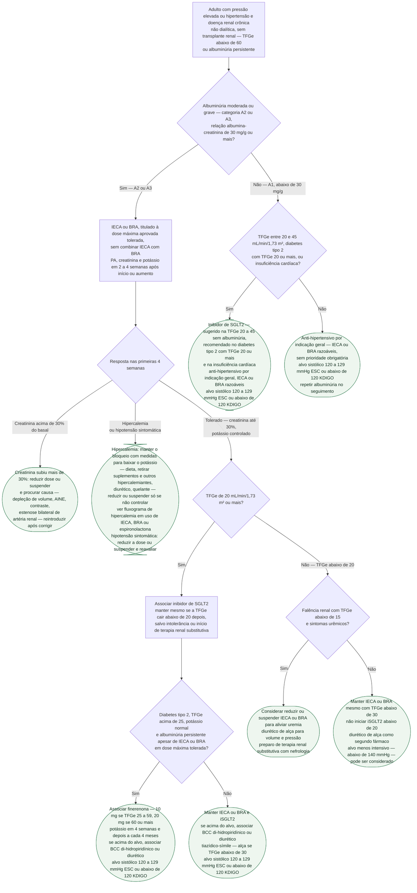

# Fluxograma: Hipertensão na doença renal crônica — alvo, bloqueio do SRAA, iSGLT2 e finerenona

No hipertenso com doença renal crônica, a mesma consulta precisa resolver quatro perguntas que costumam ser tratadas como se fossem uma só: qual é o alvo pressórico, se o bloqueio do sistema renina-angiotensina está indicado e em que dose, se a queda de filtração e a subida do potássio depois de iniciá-lo são motivo para parar, e quais das duas classes nefroprotetoras novas — inibidor de SGLT2 e finerenona — entram, e em que ordem. A ESC 2024 e o KDIGO 2024 respondem às quatro de forma convergente, com uma diferença numérica no alvo: 120 a 129 mmHg de sistólica na europeia, abaixo de 120 mmHg no KDIGO, ambos condicionados à tolerância e à medida padronizada. O erro mais caro nessa decisão não é escolher o alvo errado — é suspender o IECA ou o BRA diante de uma alta de creatinina de até 30%, que é o efeito esperado do fármaco, e não sinal de dano.

## Árvore de decisão

O que vale para todos os ramos e ficou fora do diagrama: medida padronizada de pressão (o KDIGO adverte que aplicar o alvo abaixo de 120 mmHg a medidas não padronizadas é potencialmente perigoso); alvo menos intensivo em fragilidade, alto risco de quedas e fraturas, expectativa de vida muito limitada ou hipotensão postural sintomática; restrição de sódio abaixo de 2 g por dia; e reavaliação de PA, creatinina e potássio a cada mudança de dose de qualquer fármaco que atue no SRAA.

## O alvo: 120 a 129 ou abaixo de 120

| Diretriz | Alvo sistólico | Condição | Exceção prevista |
|---|---|---|---|
| ESC 2024 | 120–129 mmHg | DRC, se tolerado | Individualizar meta menos intensiva quando houver fragilidade, hipotensão ortostática, sintomas ou baixa tolerabilidade |
| KDIGO 2024 (rec. 3.4.1) e KDIGO 2021 (rec. 3.1.1) | abaixo de 120 mmHg | quando tolerado, com medida padronizada de consultório — grau 2B | fragilidade, risco de quedas e fraturas, expectativa de vida muito limitada, hipotensão postural sintomática |

O KDIGO é explícito sobre o que sustenta o alvo: os ensaios não demonstraram que baixar mais a pressão reduza falência renal, e a recomendação se apoia no benefício cardiovascular — sobretudo no SPRINT, que incluiu TFGe de 20 a 60. Ao mirar abaixo de 120, mais pacientes ficam abaixo de 130 mesmo sem atingir a meta. A metanálise de Malhotra et al., já registrada em controle-pressorico-na-doenca-renal-cronica-estagios-3-a-5, mostra a mesma coisa por outro ângulo: a separação real dos ensaios foi 132 contra 140 mmHg, com mortalidade 14% menor no braço intensivo — evidência de estratégia, não de um número. Para a prática no Brasil, a Diretriz Brasileira de 2025 fixa 130/80 mmHg como meta geral, como registrado em fluxograma-hipertensao-arterial-esc-2024.

## Bloqueio do SRAA: quem, em que dose, e o que tolerar

A albuminúria é o que decide, e o grau de recomendação muda com a categoria e com o diabetes:

| Situação (KDIGO 2024, recomendações 3.6.1 a 3.6.3) | Recomendação |
|---|---|
| Albuminúria grave (A3, acima de 300 mg/g), sem diabetes | IECA ou BRA recomendado — 1B |
| Albuminúria moderada (A2, 30 a 300 mg/g), sem diabetes | IECA ou BRA sugerido — 2C |
| Albuminúria moderada ou grave (A2 ou A3), com diabetes | IECA ou BRA recomendado — 1B |
| Sem albuminúria (A1) | considerar por indicação específica — hipertensão, IC com fração reduzida (ponto de prática 3.6.6) |

A ESC 2024 coincide ao recomendar IECA ou BRA na DRC com albuminúria moderada a grave. A árvore ancora a indicação e o seguimento nas recomendações diretamente verificadas do KDIGO 2024. Três regras acompanham a prescrição:

- dose máxima aprovada que o paciente tolere, porque foi com essas doses que os ensaios mostraram benefício;
- PA, creatinina e potássio em 2 a 4 semanas após início ou aumento de dose;
- continuar a menos que a creatinina suba mais de 30% em 4 semanas; considerar reduzir ou suspender apenas em hipotensão sintomática, hipercalemia não controlada apesar de tratamento, ou para aliviar sintomas urêmicos na falência renal com TFGe abaixo de 15.

Combinar IECA, BRA e inibidor direto de renina entre si é contraindicado (recomendação 3.6.4, 1B). O que fazer quando a creatinina ultrapassa os 30% — procurar depleção de volume, anti-inflamatório, contraste e estenose bilateral de artéria renal antes de culpar o fármaco, e reintroduzir depois — vem de elevacao-de-creatinina-ao-iniciar-ieca-ou-bra-quando-manter-e-quando-suspender, que traz a revisão de Bakris e Weir em que o limiar se originou. O próprio KDIGO 2021 reconhece que nenhum ensaio comparou manter, reduzir ou suspender diante de altas de 10%, 20% ou 30%: o limiar é opinião de especialista consolidada.

## Hipercalemia: o ramo que encaminha

O KDIGO não fixa um número de potássio para suspender o IECA ou o BRA — a instrução é manter o bloqueio e tratar o potássio (restrição dietética, retirada de suplementos, substitutos de sal e fármacos hipercalemiantes, diurético caliurético, quelante oral), reduzindo ou suspendendo apenas quando essas medidas falham. O corte de 5,5 mmol/L que aparece na literatura vem do algoritmo de finerenona (abaixo) e da definição operacional de hipercalemia usada em fluxograma-hipercalemia-em-uso-de-ieca-bra-ou-espironolactona, que separa a urgência com alteração eletrocardiográfica da hipercalemia leve a moderada e decide entre quelante e suspensão — este fluxograma não repete aquela árvore, apenas entrega o paciente a ela.

## Inibidor de SGLT2: a TFGe decide o início, não a continuação

| Situação (KDIGO 2024) | Recomendação |
|---|---|
| Diabetes tipo 2, DRC, TFGe 20 ou mais | recomendado — 1A (rec. 3.7.1) |
| Qualquer DRC, TFGe 20 ou mais e albuminúria 200 mg/g ou mais | recomendado — 1A (rec. 3.7.2) |
| Insuficiência cardíaca, qualquer albuminúria | recomendado — 1A (rec. 3.7.2) |
| TFGe 20 a 45 com albuminúria abaixo de 200 mg/g | sugerido — 2B (rec. 3.7.3) |

A ESC 2024 simplifica para "DRC, TFGe de 20 ou mais e albuminúria", classe I, nível A. Dois pontos de prática mudam a conduta: uma vez iniciado, é razoável manter o iSGLT2 mesmo se a TFGe cair abaixo de 20, salvo intolerância ou início de terapia renal substitutiva; e a queda reversível de TFGe ao iniciar não é, em geral, motivo para suspender. Suspender temporariamente em jejum prolongado, cirurgia ou doença crítica pelo risco de cetose. A escolha entre iSGLT2 e agonista de GLP-1 por condição predominante, no diabético com doença cardiovascular, está em fluxograma-escolha-isglt2-glp1-diabetico-doenca-cardiovascular e não é repetida aqui.

## Finerenona: quem, em que dose e como vigiar o potássio

O KDIGO 2024 (recomendação 3.8.1, 2A) sugere antagonista mineralocorticoide não esteroidal com benefício renal ou cardiovascular comprovado para adultos com diabetes tipo 2, TFGe acima de 25, potássio normal e albuminúria acima de 30 mg/g apesar da dose máxima tolerada de IECA ou BRA; pode ser adicionada a IECA ou BRA e iSGLT2 (ponto de prática 3.8.2). As doses e os cortes de potássio abaixo são os da Figura 26 do KDIGO 2024, adaptada dos protocolos de FIDELIO-DKD e FIGARO-DKD, e conferem com o RCM europeu registrado em finerenona (Farmacologia):

| Potássio sérico | Conduta |
|---|---|
| 4,8 mmol/L ou menos | iniciar: 10 mg/dia se TFGe 25 a 59, 20 mg/dia se 60 ou mais; potássio em 1 mês e depois a cada 4 meses; subir para 20 mg se estava em 10 |
| 4,9 a 5,5 mmol/L | manter 10 ou 20 mg; potássio a cada 4 meses |
| acima de 5,5 mmol/L | suspender; ajustar dieta e fármacos concomitantes; repetir potássio; reiniciar 10 mg quando potássio 5,0 ou menos |

O KDIGO considera esses limiares conservadores e admite manter o antagonista com potássio entre 5,5 e 6,0 em casos selecionados; a bula americana aprova início com potássio abaixo de 5,0. Os desfechos duros que sustentam a recomendação — falência renal no FIDELIO-DKD, composto cardiovascular no FIGARO-DKD — estão em finerenona-fidelio-dkd-figaro-dkd-e-a-fidelity, e o ensaio CONFIDENCE, em confidence-combinacao-de-finerenona-e-empagliflozina-na-doenca-renal-cronica-diabetica, mostrou que a combinação com empagliflozina reduz mais a albuminúria sem reduzir o risco de hipercalemia da finerenona — a vigilância de potássio não afrouxa quando as duas classes se somam. Espironolactona segue útil na hipertensão refratária, mas com hipercalemia e queda reversível de filtração mais prováveis quanto menor a TFGe (KDIGO 2021, ponto de prática 3.2.7).

## TFGe abaixo de 30 e abaixo de 20

Abaixo de 30, o IECA ou BRA continua quando tolerado (KDIGO 2024, ponto de prática 3.6.7). O KDIGO 2021 registra que tiazídicos perdem parte da eficácia natriurética com a queda da filtração, embora clortalidona, metolazona e indapamida possam manter efeito, e que diuréticos de alça são frequentemente eficazes nessa faixa. Abaixo de 20, não se inicia iSGLT2, mas não se retira automaticamente o que já estava em uso. Abaixo de 15 com sintomas urêmicos, reduzir ou suspender o bloqueio do SRAA pode ser opção de conforto, e o preparo da terapia renal substitutiva é a decisão principal. Transplantado renal e paciente em diálise ficam fora desta árvore.

## Limitações e o que confirmar

- A Tabela de Recomendações 26 da ESC 2024 foi lida no texto integral em academic.oup.com em uma única extração automatizada; a prosa da seção 9.7 não foi recuperada. A redação exata da linha do alvo (se o texto diz "DRC" ou "DRC com albuminúria") e o nível de evidência de cada linha merecem conferência na tabela impressa antes da publicação clínica.
- O KDIGO não define um valor numérico de potássio para reduzir ou suspender IECA ou BRA; o 5,5 mmol/L desta árvore vem do algoritmo de finerenona e do fluxograma de hipercalemia do acervo. O limiar de 5,6 mmol/L de Bakris e Weir, registrado no documento sobre elevação de creatinina, é anterior às diretrizes atuais.
- A conduta após alta de creatinina acima de 30% (investigar causas e reintroduzir) é derivada do documento do acervo sobre Bakris e Weir; o KDIGO apenas diz "continuar a menos que" e reconhece que não há ensaio comparando manter, reduzir ou suspender.
- O ramo sem albuminúria (A1) simplifica: o KDIGO só "considera" IECA ou BRA por indicação específica e o iSGLT2 é sugestão 2B na TFGe 20 a 45; a ESC 2024 não trata desse subgrupo separadamente.
- O ramo de falência renal (TFGe abaixo de 15) reproduz o ponto de prática 3.6.5 do KDIGO 2024 e não substitui a decisão de nefrologia sobre início de diálise.
- Este fluxograma não incorpora a Diretriz Brasileira de Hipertensão de 2025 além do alvo geral de 130/80 mmHg já registrado no acervo; suas metas específicas para DRC não foram lidas nesta sessão.

## Tudo com Tudo

- [Fluxograma: hipercalemia em uso de IECA, BRA ou espironolactona](/biblioteca/fluxograma-hipercalemia-em-uso-de-ieca-bra-ou-espironolactona)
- [Elevação de Creatinina ao Iniciar IECA ou BRA: Quando Manter e Quando Suspender](/biblioteca/elevacao-de-creatinina-ao-iniciar-ieca-ou-bra-quando-manter-e-quando-suspender)
- [Controle Pressórico na Doença Renal Crônica Estágios 3 a 5: Intensivo ou Menos Intensivo?](/biblioteca/controle-pressorico-na-doenca-renal-cronica-estagios-3-a-5)
- [Fluxograma: Pressão arterial elevada e hipertensão — da medida ao alvo (ESC 2024)](/biblioteca/fluxograma-hipertensao-arterial-esc-2024)
- [Fluxograma: Escolha entre inibidor de SGLT2 e agonista de GLP-1 no diabético com doença cardiovascular](/biblioteca/fluxograma-escolha-isglt2-glp1-diabetico-doenca-cardiovascular)
- [Finerenona: FIDELIO-DKD, FIGARO-DKD e a Análise Agrupada FIDELITY](/biblioteca/finerenona-fidelio-dkd-figaro-dkd-e-a-fidelity)
- [CONFIDENCE: Combinação de Finerenona e Empagliflozina na Doença Renal Crônica Diabética](/biblioteca/confidence-combinacao-de-finerenona-e-empagliflozina-na-doenca-renal-cronica-diabetica)
