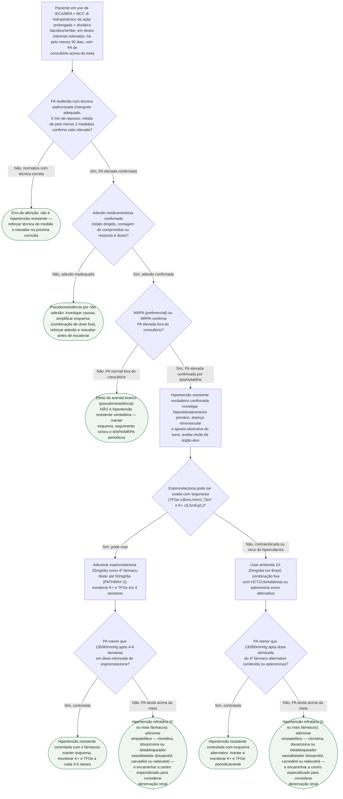

# Fluxograma: Hipertensão Resistente — da Pseudorresistência à Quarta Droga

Esta pasta já tem três fluxogramas — crise adrenérgica do feocromocitoma, emergência hipertensiva por síndrome-alvo e o caminho geral de diagnóstico e alvo da ESC 2024 —, mas nenhum cobre a situação ambulatorial mais comum de escalonamento terapêutico: o paciente que já usa três anti-hipertensivos em dose otimizada e continua acima da meta. Este fluxograma fecha essa lacuna, unindo dois documentos já publicados nesta pasta — a distinção entre hipertensão resistente verdadeira e pseudorresistente (`hipertensao-resistente-verdadeira-versus-pseudorresistente-tecnica-adesao-avental-branco.md`) e o ensaio PATHWAY-2 sobre a espironolactona como quarta droga (`hipertensao-resistente-espironolactona-como-quarta-droga-o-ensaio-pathway-2.md`) — na sequência de decisão passo a passo descrita pelo Capítulo 12 da Diretriz Brasileira de Hipertensão 2025.

O ponto central é que "hipertensão resistente" não é um rótulo que se aplica só olhando a pressão do consultório: cerca de metade dos pacientes inicialmente classificados como resistentes deixam de sê-lo depois de corrigir a técnica de aferição, confirmar adesão e excluir o efeito do avental branco por MAPA ou MRPA. Só depois dessa exclusão o algoritmo farmacológico da diretriz — espironolactona como quarta droga, com evidência randomizada e cruzada do PATHWAY-2 — entra em cena.

## Árvore de decisão

**Nota:** a meta de PA <130/80mmHg usada nos nós de decisão finais tem, na Diretriz Brasileira de Hipertensão 2025, força de recomendação **fraca** e certeza de evidência **baixa** — diferente da robustez da meta geral da população hipertensa. As alternativas intervencionistas (denervação renal por radiofrequência ou ultrassom) e os fármacos ainda em pesquisa para hipertensão resistente (inibidores da aldosterona sintase, antagonista do receptor de endotelina, siRNA contra angiotensinogênio) têm documentos próprios nesta pasta e não foram comparados à espironolactona em ensaio direto — por isso entram só depois da quarta droga neste fluxograma, e não antes dela.
