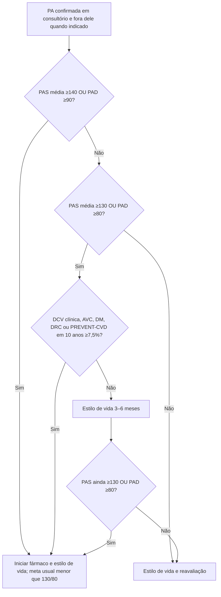

# Fluxograma — fármaco para PA na prevenção primária

Aplicar a adultos estáveis, após excluir emergência hipertensiva e com confirmação adequada da PA. Gestação/puerpério e fragilidade avançada exigem protocolos específicos. PREVENT de10anos deve respeitar faixa validada30–79anos e ausência de DCV prévia; DCV clínica é critério próprio, sem necessidade de calcular risco.

## Leitura rápida

- PREVENT aqui é **CVD total** (ASCVD + IC), corte **7,5%**.
- Não use o 5% ou 10% da diretriz de LDL neste fluxograma.
- Fragilidade avançada e gravidez saem desta árvore — módulos próprios.

## Conteúdo CorVIA conectado

- [PREVENT para iniciar anti-hipertensivo na prevenção primária](/biblioteca/aha-acc-risco-prevent-para-iniciar-anti-hipertensivo-prevencao-primaria)
- [As três equações PREVENT e quando usar cada uma](/biblioteca/tres-equacoes-prevent-cvd-ascvd-hf-quando-usar-cada-uma)
- [Pooled Cohort Equations e equações PREVENT](/biblioteca/pooled-cohort-equations-e-equacoes-prevent-risco-cardiovascular-em-prevencao-primaria)
