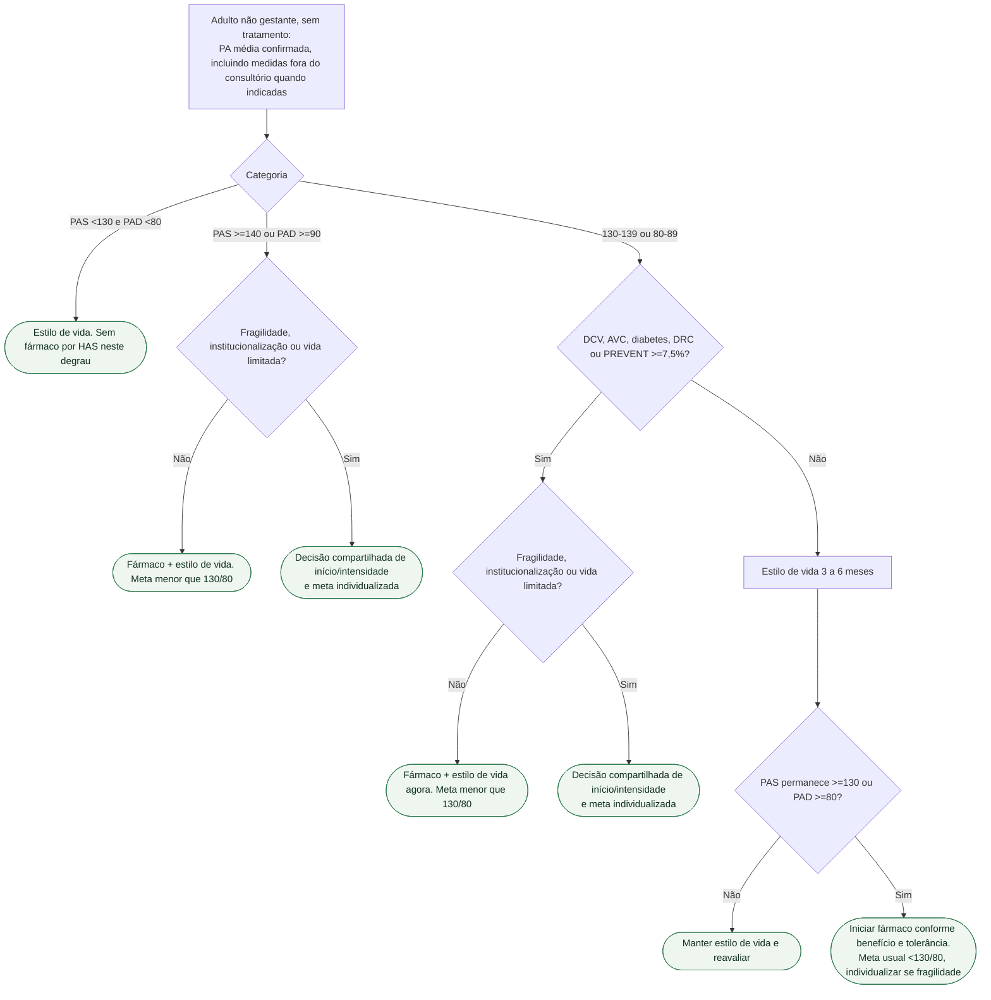

# Fluxograma: iniciar fármaco na HAS — AHA/ACC 2025 e PREVENT ≥7,5%

## Árvore de decisão

## Tudo com Tudo

Hipertensão · Prevenção e lipídios · Diabetes e cardiologia · Cardiorrenal · Comunicação clínica.
A árvore aborda início eletivo; PA grave com lesão aguda de órgão-alvo exige atendimento de emergência. Em quem já usa fármacos, PA controlada não é indicação de retirada. Não calcular PREVENT em gestação, DCV estabelecida ou fora de 30–79 anos; em idosos além dessa faixa, avaliar benefício/dano e objetivos de cuidado. A categoria é determinada pelo componente sistólico ou diastólico mais elevado.
