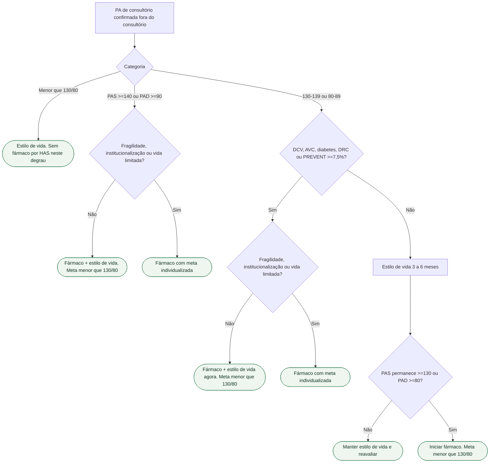

# Fluxograma: iniciar fármaco na HAS — AHA/ACC 2025 e PREVENT ≥7,5%

Aplicável ao início de tratamento em adultos não grávidos. PA já controlada com medicamento não implica suspensão. PREVENT estima risco cardiovascular total em 10 anos; usar na faixa etária elegível. Emergência hipertensiva requer protocolo próprio.

## Árvore de decisão

## Tudo com Tudo

- [Equação PREVENT e o limiar de 7,5% na diretriz AHA/ACC 2025 de hipertensão](/biblioteca/equacao-prevent-aha-e-o-limiar-75-na-diretriz-2025)
- [ESC 2026 STAMP e PREVENT: duas portas de rastreio que o clínico geral não pode perder](/biblioteca/esc-2026-stamp-e-prevent-duas-portas-de-rastreio-que-o-clinico-geral-nao-pode-perder)
- [Alvo 140/90 na gestante — não é a meta 130/80](/biblioteca/alvo-140-90-na-gestante-nao-e-a-meta-130-80)
