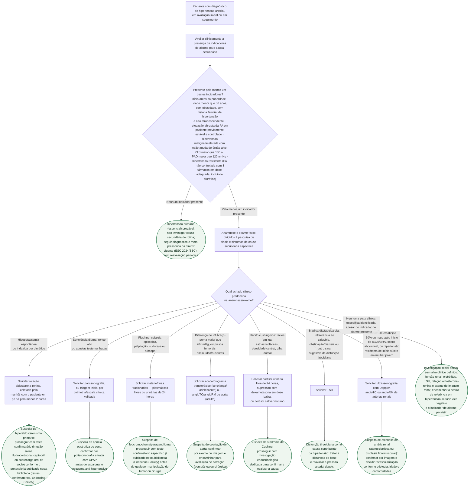

# Fluxograma: Investigação de Hipertensão Secundária — Quando Suspeitar e Por Onde Começar

Nem todo hipertenso precisa investigar causa secundária, e a diferença não está no valor da pressão isoladamente — está em um pequeno conjunto de indicadores de alarme (idade de início, velocidade de instalação, gravidade e resposta ao tratamento). Uma vez presente pelo menos um desses indicadores, o passo seguinte não é pedir "todos os exames": é deixar a anamnese e o exame físico apontarem qual causa é mais provável, porque cada pista clínica leva a um exame de triagem diferente. Este fluxograma organiza essa primeira bifurcação — que este acervo ainda não tinha em formato de árvore de decisão — e entrega, no fim de cada ramo, o exame inicial certo para aquela suspeita, sem repetir os protocolos de teste confirmatório que já estão publicados nesta mesma pasta para hiperaldosteronismo primário e feocromocitoma.

## Árvore de decisão

## Por que a triagem começa pela pista clínica, não por um painel de exames

Pedir aldosterona/renina, metanefrinas, cortisol, TSH e imagem renal para todo hipertenso com um indicador de alarme multiplica falso-positivo sem aumentar o rendimento diagnóstico — cada teste tem melhor desempenho quando pedido a partir de uma probabilidade pré-teste real, construída pela clínica. É esse o papel da anamnese e do exame físico dirigidos (nó `P2`): eles não substituem o exame confirmatório, mas decidem qual exame de triagem pedir primeiro.

## O que este fluxograma não substitui

Os testes confirmatórios de hiperaldosteronismo primário (relação aldosterona-renina anormal) e de feocromocitoma (metanefrinas elevadas) — cortes exatos, condições de coleta e algoritmo de confirmação — estão no documento `aldosteronismo-primario-e-feocromocitoma-testes-confirmatorios-endocrine-society.md`, já publicado nesta pasta. A prevalência de cada causa secundária por faixa etária e a comparação entre nicardipina e labetalol na emergência hipertensiva estão em `emergencia-hipertensiva-e-triagem-de-hipertensao-secundaria.md`. Este fluxograma é o elo que faltava entre os dois: o momento de decisão, em consultório, de que pista seguir primeiro.
