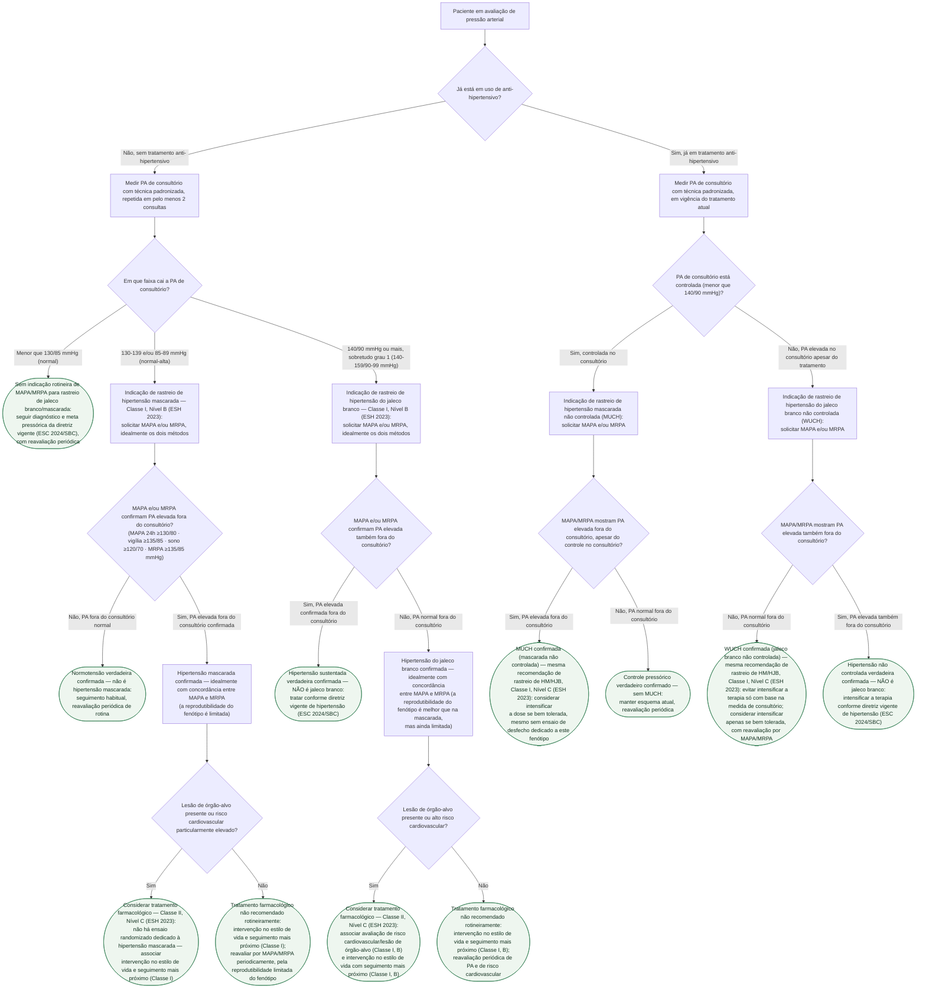

# Fluxograma: Hipertensão do Jaleco Branco e Mascarada — Quando Pedir MAPA/MRPA e Como Decidir o Tratamento

Nenhum dos cinco fluxogramas já publicados nesta pasta responde a uma pergunta
de consultório muito comum: diante de uma pressão de consultório específica,
**quando vale a pena pedir MAPA ou MRPA**, e o que fazer com o resultado. O
documento em prosa já publicado nesta mesma pasta traz os cortes diagnósticos
exatos (Tabela 4 da ESH 2023), a prevalência de cada fenótipo e a recomendação
formal de classe/nível — mas em texto corrido, sem o caminho de decisão passo a
passo. Este fluxograma organiza esse caminho em árvore, separando quem nunca
tratou (investigação de jaleco branco ou de mascarada) de quem já está em
tratamento (investigação de WUCH — jaleco branco não controlada — ou de MUCH —
mascarada não controlada), e termina sempre na decisão prática: tratar com
fármaco ou não.

## Árvore de decisão

## Por que a árvore se separa logo no início entre tratado e não tratado

A ESH 2023 define hipertensão do jaleco branco e hipertensão mascarada
especificamente em quem **nunca tratou** — são fenótipos diagnósticos. Em
quem já está em tratamento, os nomes mudam para **WUCH** (*white-coat
uncontrolled hypertension*) e **MUCH** (*masked uncontrolled hypertension*),
e a pergunta clínica também muda: não é mais "este paciente tem
hipertensão?", é "o controle que a PA de consultório sugere é real?". Tratar
os dois cenários como se fossem o mesmo caminho de decisão confundiria uma
pergunta diagnóstica com uma pergunta de reavaliação terapêutica — por isso a
bifurcação `D1` vem antes de qualquer corte de PA.

## O que este fluxograma não decide sozinho

A recomendação de tratamento farmacológico em hipertensão do jaleco branco e
em hipertensão mascarada é **Classe II, Nível C** nos dois sentidos — a ESH
2023 é explícita que nunca houve ensaio randomizado dedicado a nenhum dos dois
fenótipos, então a decisão de tratar depende de uma avaliação de lesão de
órgão-alvo e de risco cardiovascular global que este fluxograma não substitui
(nós `D4` e `D6`). A reprodutibilidade limitada dos dois fenótipos — pior na
hipertensão mascarada que na do jaleco branco, e pior por MRPA que por MAPA —
é o motivo pelo qual a diretriz recomenda repetir a medida fora do
consultório antes de fechar qualquer um dos diagnósticos desta árvore, e não
apenas confiar num único MAPA ou MRPA isolado.
