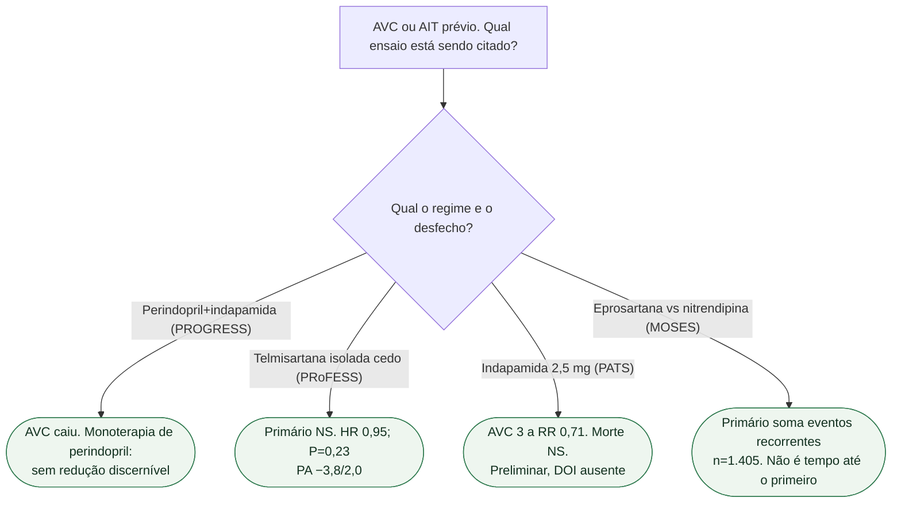

# Fluxograma: baixar a PA depois do AVC

```mermaid
flowchart TD
  R0["AVC ou AIT prévio. Qual ensaio está sendo citado?"] --> D1{"Qual o regime e o desfecho?"}

  D1 -->|"Perindopril+indapamida (PROGRESS)"| C1(["AVC caiu. Monoterapia de perindopril:<br/>sem redução discernível"])

  D1 -->|"Telmisartana isolada cedo (PRoFESS)"| C2(["Primário NS. HR 0,95; P=0,23<br/>PA −3,8/2,0"])

  D1 -->|"Indapamida 2,5 mg (PATS)"| C3(["AVC 3 a RR 0,71. Morte NS.<br/>Preliminar, DOI ausente"])

  D1 -->|"Eprosartana vs nitrendipina (MOSES)"| C4(["Primário soma eventos recorrentes<br/>n=1.405. Não é tempo até o primeiro"])

  classDef conduta fill:#eef6ef,stroke:#2f7a4f,color:#12301f;
  class C1,C2,C3,C4 conduta;
```

## Mensagem prática

**A âncora da casa continua sendo a combinação do PROGRESS.** PRoFESS não autoriza BRA isolado. MOSES não derruba PRoFESS.
