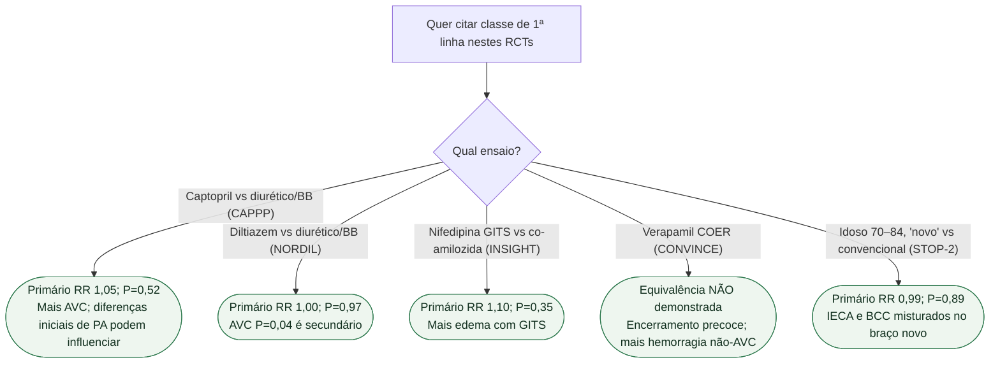

# Fluxograma: resultados neutros não demonstram equivalência

## Mensagem prática

**Ausência de diferença significativa nos desfechos primários não prova equivalência entre estratégias.** Resultados de AVC em ensaios individuais devem ser interpretados com o desfecho primário, controle pressórico e multiplicidade. O fluxograma organiza evidência histórica; não substitui seleção terapêutica conforme comorbidades e diretrizes vigentes.

## Tudo com Tudo

- [CONVINCE: verapamil COER vs atenolol/HCTZ — não demonstrou equivalência; ensaio fechado pelo patrocinador](/biblioteca/convince-verapamil-coer-versus-atenolol-ou-hctz-na-has) — Liga o fluxograma histórico de primeira linha ao CONVINCE e seus limites, evitando afirmar equivalência a partir de primário não significativo.
