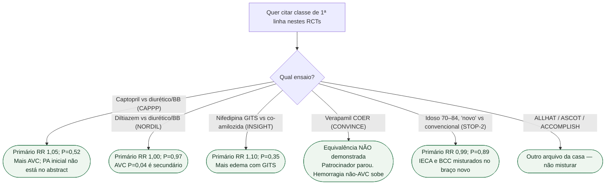

# Fluxograma: primeira linha que empatou

```mermaid
flowchart TD
  R0["Quer citar classe de 1ª linha nestes RCTs"] --> D1{"Qual ensaio?"}

  D1 -->|"Captopril vs diurético/BB (CAPPP)"| C1(["Primário RR 1,05; P=0,52<br/>Mais AVC; PA inicial não está no abstract"])

  D1 -->|"Diltiazem vs diurético/BB (NORDIL)"| C2(["Primário RR 1,00; P=0,97<br/>AVC P=0,04 é secundário"])

  D1 -->|"Nifedipina GITS vs co-amilozida (INSIGHT)"| C3(["Primário RR 1,10; P=0,35<br/>Mais edema com GITS"])

  D1 -->|"Verapamil COER (CONVINCE)"| C4(["Equivalência NÃO demonstrada<br/>Patrocinador parou. Hemorragia não-AVC sobe"])

  D1 -->|"Idoso 70–84, 'novo' vs convencional (STOP-2)"| C5(["Primário RR 0,99; P=0,89<br/>IECA e BCC misturados no braço novo"])

  D1 -->|"ALLHAT / ASCOT / ACCOMPLISH"| C6(["Outro arquivo da casa — não misturar"])

  classDef conduta fill:#eef6ef,stroke:#2f7a4f,color:#12301f;
  class C1,C2,C3,C4,C5,C6 conduta;
```

## Mensagem prática

**Nesta leva o primário empatou.** Não vender AVC de NORDIL/CAPPP/SCOPE como vitória de classe. ALLHAT continua no combinado.
