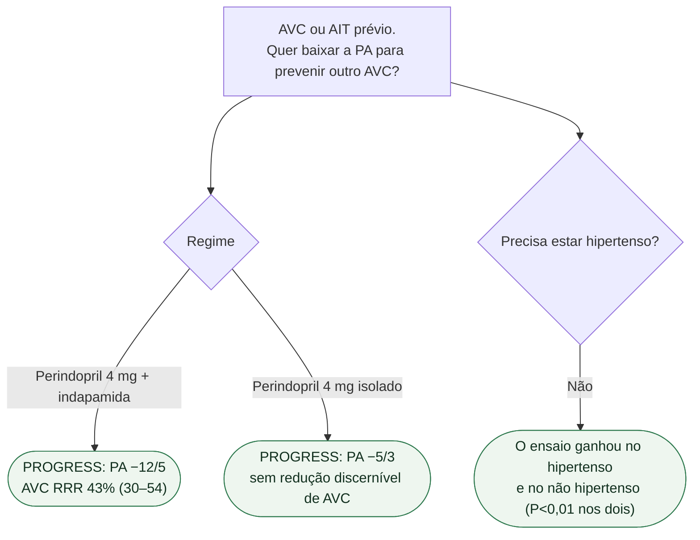

# Fluxograma: PA depois do AVC (PROGRESS)

## Mensagem prática

**Depois do AVC, a evidência deste ensaio é da combinação, não do IECA sozinho.** Independente da PA de entrada. PRoFESS (telmisartana isolada) empatou — ver fluxograma-pa-apos-avc-progress-profess-pats-moses.
