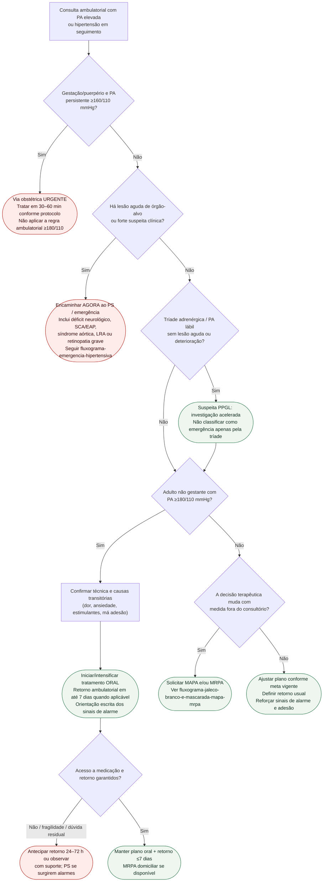

# Fluxograma: sinais de alarme ambulatoriais na hipertensão

Prosa: [`sinais-de-alarme-ambulatoriais-na-hipertensao-quando-encaminhar`](sinais-de-alarme-ambulatoriais-na-hipertensao-quando-encaminhar.md). Emergência com lesão aguda: [`fluxograma-emergencia-hipertensiva`](fluxograma-emergencia-hipertensiva.md).

## Árvore de decisão

## Notas

- **D0** vem antes de qualquer regra geral: na gestação/puerpério, PA persistente ≥160/110 mmHg requer manejo obstétrico urgente mesmo sem sintomas neurológicos/visuais.
- **D1** inclui lesão objetiva assintomática, como retinopatia hipertensiva grave ao exame de fundo de olho.
- **D1B** evita classificar PPGL estável como emergência apenas pela tríade cefaleia-sudorese-palpitacões/PA lábil.
- **D2** aplica-se ao adulto não gestante depois de excluir os ramos anteriores.
- Nifedipina **sublingual** não integra nenhuma via deste fluxograma.
