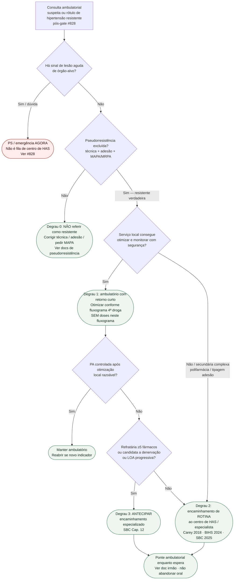

# Fluxograma: timing de encaminhamento ambulatorial na hipertensão resistente

Prosa: [`timing-de-encaminhamento-ambulatorial-na-hipertensao-resistente`](timing-de-encaminhamento-ambulatorial-na-hipertensao-resistente.md) · [`ponte-ambulatorial-enquanto-espera-centro-has-na-resistente`](ponte-ambulatorial-enquanto-espera-centro-has-na-resistente.md).

Gate prévio (PS vs retorno precoce): [#828](https://github.com/rafaelpaesmeirelles/MeuCardio/pull/828). Destino de secundária (especialidade): [#865](https://github.com/rafaelpaesmeirelles/MeuCardio/pull/865). Quarta droga: [`fluxograma-hipertensao-resistente-quarta-droga`](fluxograma-hipertensao-resistente-quarta-droga.md).

## Árvore de decisão

## Notas

- **D0** = gate de segurança (#828) — não é o gate de secundária (#865).
- **D1** = só depois disso existe "resistente verdadeira".
- **D2/D4** = escolhem **timing** (ficar / rotina / antecipar), não a dose da 4ª droga.
- Destino endocrino/nefrologia/sono quando a pista é de secundária → [#865](https://github.com/rafaelpaesmeirelles/MeuCardio/pull/865).
