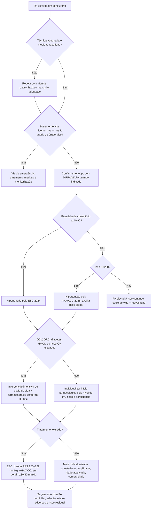
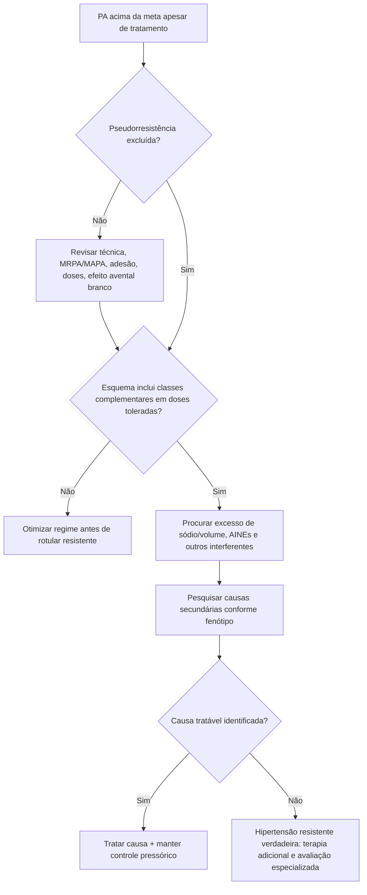

# Hipertensão arterial: ESC 2024 vs AHA/ACC 2025

## Por que este documento importa

A ESC 2024 e a AHA/ACC 2025 convergem em um ponto prático: o tratamento da pressão arterial deve ser guiado não apenas pelo número observado em consultório, mas pelo **risco cardiovascular global, presença de doença cardiovascular/renal/diabetes, tolerabilidade e confirmação adequada da pressão arterial**.

A ESC 2024 introduziu a categoria **pressão arterial elevada** (antes do limiar clássico de hipertensão) e enfatizou, para a maioria dos adultos em tratamento, **PAS de 120–129 mmHg quando tolerada**. A AHA/ACC 2025 mantém abordagem de intervenção precoce e meta geral <130/80 mmHg para a maioria dos adultos tratados.

> Este conteúdo é educacional e está marcado como `pendente_revisao` até conferência institucional da recomendação completa, classe e nível de evidência de cada sociedade.

## Conceitos que não devem ser misturados

### ESC 2024

- Hipertensão permanece definida por **PA de consultório ≥140/90 mmHg**.
- A diretriz cria a categoria de **PA elevada**, destacando risco cardiovascular contínuo abaixo de 140/90 mmHg.
- Para adultos usando tratamento anti-hipertensivo, a meta de PAS proposta para a maioria é **120–129 mmHg, se tolerada**.
- A diretriz permite individualização/"opt-out" desse alvo em cenários como sintomas ortostáticos, fragilidade, idade muito avançada ou expectativa de vida limitada.

### AHA/ACC 2025

- Mantém a classificação norte-americana com hipertensão a partir de **130/80 mmHg**.
- A meta terapêutica geral permanece **<130/80 mmHg** para a maioria dos adultos tratados.
- O início de fármaco depende do nível pressórico e do risco cardiovascular/comorbidades, e não de um número isolado.

## Árvore de decisão: confirmar, classificar e tratar

## Quando pensar em hipertensão secundária

A investigação deve ser direcionada quando houver pistas clínicas, incluindo:

- hipertensão resistente ou de início abrupto;
- idade jovem com hipertensão importante;
- hipocalemia espontânea ou desproporcional ao diurético;
- piora súbita da função renal ou aumento de creatinina após bloqueio do SRAA em contexto sugestivo;
- paroxismos adrenérgicos;
- apneia obstrutiva do sono provável;
- sinais clínicos de doença endócrina;
- diferença significativa de pulsos/PA ou suspeita de coarctação.

## Árvore de decisão: hipertensão resistente

## Diferença prática entre as duas diretrizes

O valor clínico não está em escolher uma sociedade como "certa" e outra como "errada". O ponto central é registrar qual referência está sendo usada. Um paciente com PA 134/82 mmHg não é hipertenso pela definição ESC 2024, mas se enquadra em hipertensão estágio 1 pela classificação AHA/ACC. Ainda assim, ambas as abordagens enfatizam que **risco absoluto e comorbidades** modulam a necessidade de tratamento farmacológico.

## Armadilhas

1. **Não diagnosticar hipertensão por uma medida isolada**, exceto em contextos de PA muito elevada com quadro clínico apropriado.
2. **Não perseguir 120–129 mmHg de PAS a qualquer custo** em quem desenvolve ortostatismo, quedas ou intolerância.
3. **Não chamar hipertensão de resistente antes de excluir pseudorresistência e baixa adesão.**
4. **Não confundir alvo terapêutico com limiar diagnóstico.**

## Fontes verificadas

1. McEvoy JW, McCarthy CP, Bruno RM, et al. 2024 ESC Guidelines for the management of elevated blood pressure and hypertension. *Eur Heart J.* 2024;45(38):3912-4018. PMID **39210715**. DOI **10.1093/eurheartj/ehae178**.
2. Writing Committee Members; Jones DW, Ferdinand KC, Taler SJ, et al. 2025 AHA/ACC/AANP/AAPA/ABC/ACCP/ACPM/AGS/AMA/ASPC/NMA/PCNA/SGIM Guideline for the Prevention, Detection, Evaluation and Management of High Blood Pressure in Adults. *Circulation.* 2025;152(11):e114-e218. PMID **40811497**. DOI **10.1161/CIR.0000000000001356**.

## Status de revisão

`VERIFICAÇÃO HUMANA NECESSÁRIA`: confirmar, antes da publicação clínica final, a classe e o nível de evidência de cada recomendação pontual se estes forem posteriormente adicionados ao texto.
