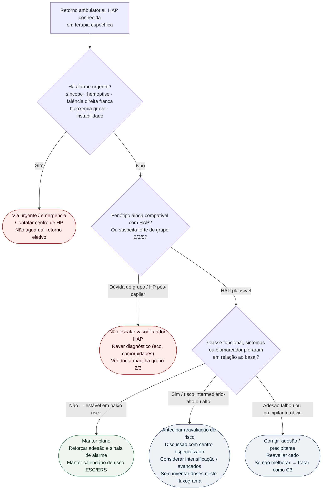

# Fluxograma ambulatorial: HAP — quando escalar ou referenciar

Prosa: [`sinalizadores-ambulatoriais-de-piora-na-hap`](sinalizadores-ambulatoriais-de-piora-na-hap.md). Armadilha de fenótipo: [`sinalizadores-ambulatoriais-nao-tratar-hp-grupo-2-3-como-hap`](sinalizadores-ambulatoriais-nao-tratar-hp-grupo-2-3-como-hap.md).

## Árvore de decisão

## Notas

- **D0** = gate de segurança ambulatorial (síncope e falência direita não são "ajuste de agenda").
- **D1** = evita iatrogenia: vasodilatador arterial pulmonar em HP do grupo 2 pode precipitar edema — detalhe no doc irmão e nos docs de grupo 2/3 do corpus ([`sildenafila-na-hipertensao-pulmonar-do-grupo-2-o-ensaio-siovac`](sildenafila-na-hipertensao-pulmonar-do-grupo-2-o-ensaio-siovac.md), [`hipertensao-pulmonar-do-grupo-3-dpoc-e-dpi-criterios-prognostico-e-risco-do-vasodilatador-especifico`](hipertensao-pulmonar-do-grupo-3-dpoc-e-dpi-criterios-prognostico-e-risco-do-vasodilatador-especifico.md)).
- **D2/C3** = lógica ESC/ERS 2022 de risco dinâmico e meta de baixo risco; a intensificação farmacológica ocorre no centro, não neste fluxograma.
- Não substitui [`fluxograma-hap-estratificacao-risco-terapia-combinada-inicial`](fluxograma-hap-estratificacao-risco-terapia-combinada-inicial.md).
